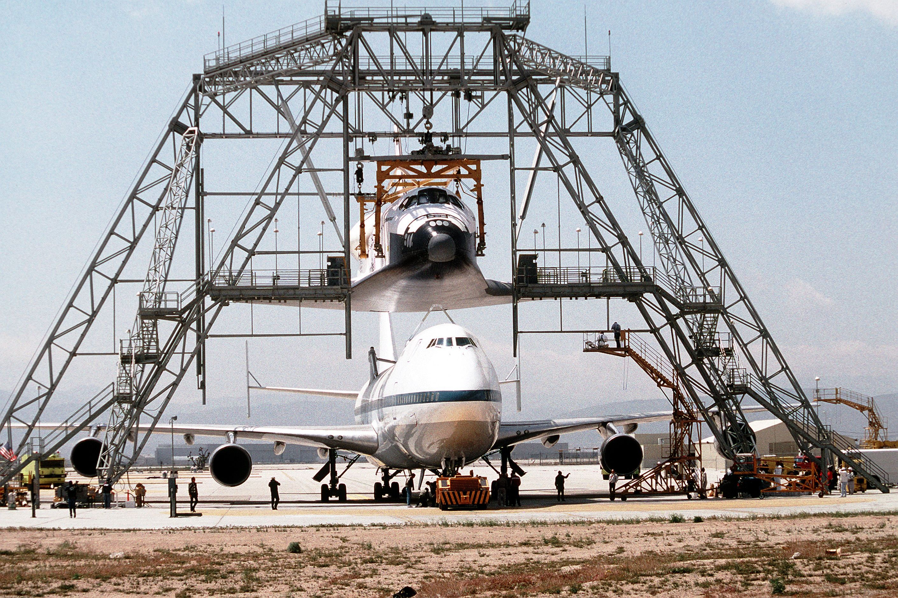
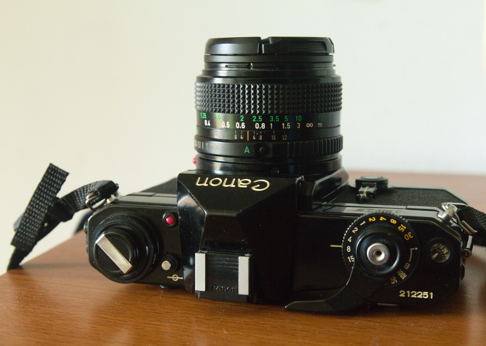
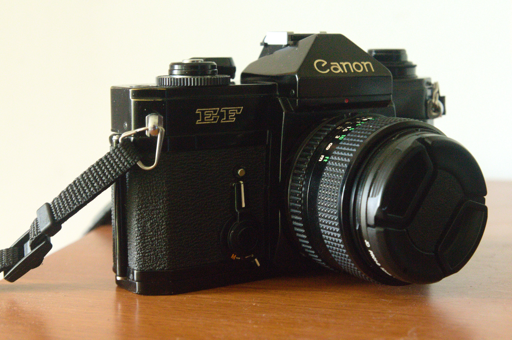
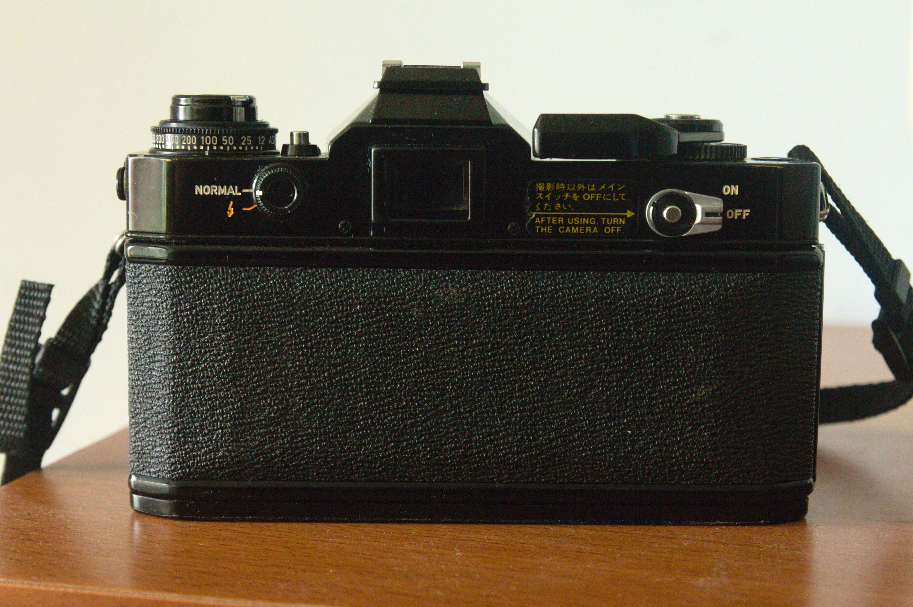
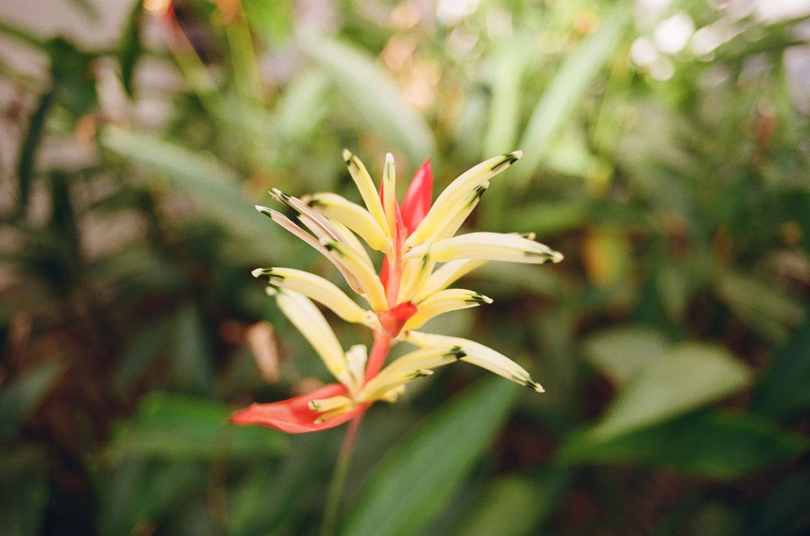
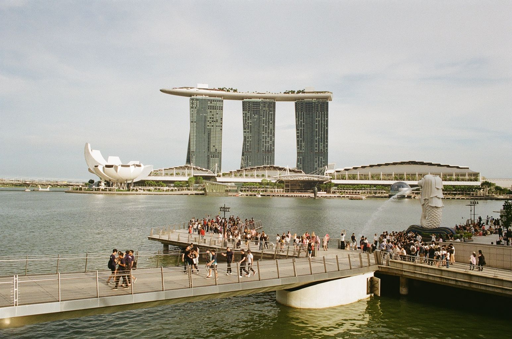
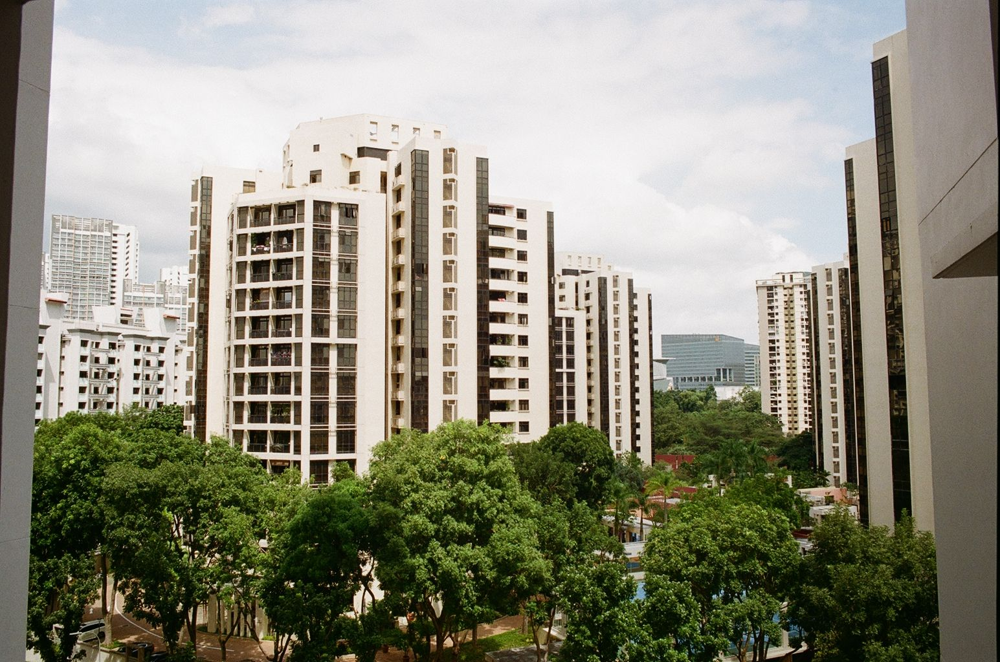

In February 2020, I developed an interest in film photography and bought my first film camera. I think my passion for film developed gradually as I looked at magazines and pictures from the 80s and 90s which had a very unique aesthetic not found in modern digital cameras.

This photograph for instance really struck me with its muted blue tones and high contrast. The highlights also seem to have very little detail. Then I noticed the grain, which unlike electronic noise, looks pleasing to the eye and adds texture to the scene unlike the clean shots from a DSLR. I believe that grain is so attractive because it is imperfect just like scruffed up jeans.

I initially tried out film simulations and adding grain to my images digitally but it never seemed to replicate the real thing. I finally decided to buy a film camera and try my hand at some analogue photography.

## Finding a camera
When I first started my search, I didn't even know the types of film cameras that existed let alone the brands. Fortunately, there is a lively analogue photography community online and I was able to find out the features of different types of film cameras. I was still unsure about what camera to buy when I went to a used camera store in Singapore. This store is located at Peninsula Shopping Centre which has many, many camera and film shops. There were many camera brands including Pentax, Minolta, Canon, Nikon, Contax, Olympus and some Russian brands. It was quite overwhelming, to be honest, and I wrte down the names of a few cameras to do further research. 

My idea of a perfect film camera was one with a rangefinder-style micro prism viewfinder, manual controls complemented by some automatic controls, a working light meter, reliability, batteryless shooting and something that would not break the bank. Essentially a camera that would allow me to shoot on the fly while still being customisable. I also wanted a 28mm wide-angle lens which would allow me to shoot in close quarters. 

## Canon EF

I found all the features that I wanted in the [Canon EF SLR](https://global.canon/en/c-museum/product/film88.html). This camera was the younger brother of the flagship Canon F1 and was produced in 1974. I bought it for 199SGD (around 140USD) and it is in fantastic condition. Since I was buying from a reputable second-hand store, I had the confidence that the camera would work without any issues.

The Canon EF has a very unique copal square metal blade shutter which is controlled electro-mechanically. This means that the shutter can be synced with the flash at up to 1/125s which is ideal for situations like parties where people are moving very quickly. The electronics also makes the shutter very accurate and allows shutter speeds of down to 30s without the need for a shutter release cable. This is really useful for my evening landscape work.

The Canon EF retains the excellent build quality of the F1 and can be operated in a limited state without the batteries. The camera weighs a ton but that does not really matter because I am used to carrying around a DSLR. But compared to a DSLR, it is smaller in size which makes it more appealing for casual situations. The light meter is very accurate overall although the meter is designed to reduce overexposure in the sky. As such the metering can vary when used in the landscape and portrait orientations. There is a shutter speed priority mode which appeals to me because it is better for reducing camera shake. 

The controls are relatively simple. Simply set the ISO (it can be set lower or higher than the film speed for exposure compensation), turn the aperture ring to A, adjust the aperture and set the shutter speed. There are also options for exposure lock, depth of field preview, self-timer and mirror lockup. The latter two being very useful for long exposure work that I regularly do. The viewfinder is quite large and has a micro prism which "shimmers" when the object is not in focus. This is a little more difficult to use compared to the split prism version which came out in a later version. At this point, I have become very familiar with the micro prism so its not an issue at all.

The only downsides I can think of the camera is its weight and its grip or lack thereof. However, these do not bother me significantly. The viewfinder is also not interchangeable which is a slight inconvenience when shooting at a lower angle. 

I bought a 28mm canon nFD lens for 100SGD (around 70USD) and it gives me sharp and contrasty images. The lens has some vignetting and softness wide open at f2.8 which I like personally. Bokeh is also very smooth which I found quite different from my Tamron 17-50mm f2.8 lens which produces sharper and more defined bokeh. The contrast also remains high when shooting into the sun. On another note, the lens is tiny and light which is fantastic when I bring it out for a casual shoot.

## Choosing the film
I have tried out a few film stocks such as Kodak Colourplus 200, Fujifilm Superia Xtra 400 and Kodak Gold 200. I think that I prefer the warm colours of Kodak Gold 200 and that its price is really quite affordable. I think that I will need to test out a few more rolls before deciding on my favourite film. Currently, I am shooting on Kodak Ektar 100 and I will post pictures produced from it in the near future. I am also trying out different labs in Singapore to process my film.

> I enjoy owning a piece of history

## Why I shoot film
Firstly, as I mentioned before, I like the aesthetic of film. Film photos stand out from digital photos and remind me of my favourite books growing up. Photography like any art is a representation of the real world in a medium. The emotion and message conveyed are often more important than the depiction itself. Although I still mainly rely on my DSLR for most shots, I use my film camera for occasions that require them.

Secondly, I find that my film camera slows me down. Considering that film is more expensive than digital and that processing takes time, I pay more attention to each shot and make it count. In today's world of instant photography and sharing, attention span is truly a commodity. Film does not have the distractions of digital photography which allows me to think and process the scene better. I wonder how the shot will look if the bird is flying past or how the trees provide framing for my shot. Consequently, the number of "keepers" from my film photos is higher than digital. Furthermore, it is much easier to work with 36 good photos rather than sieve through 100s of digital photos (although some situations require that).

Thirdly, I enjoy owning a piece of history. This camera was produced around the time my parents were little and it is interesting to experience technology from the 70s that has stood the test of time. 

## Gallery
Here are some photographs shot on Kodak Gold 200

Thank you for reading my post. Please free to get in touch [through the contact page](/contact) or social media if you have any thoughts on film photography.
