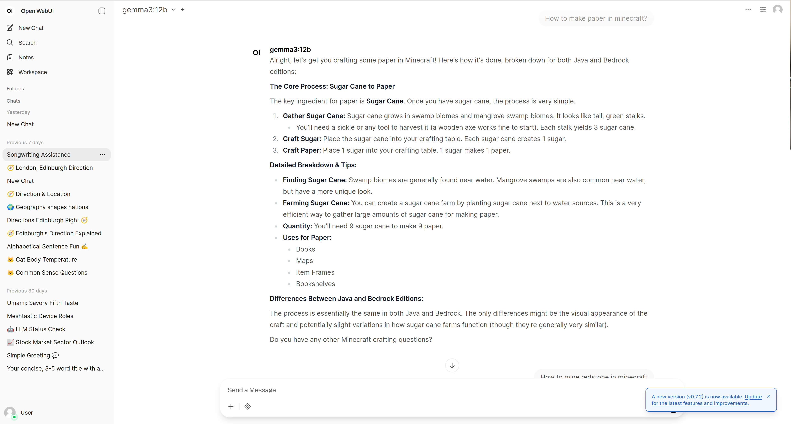
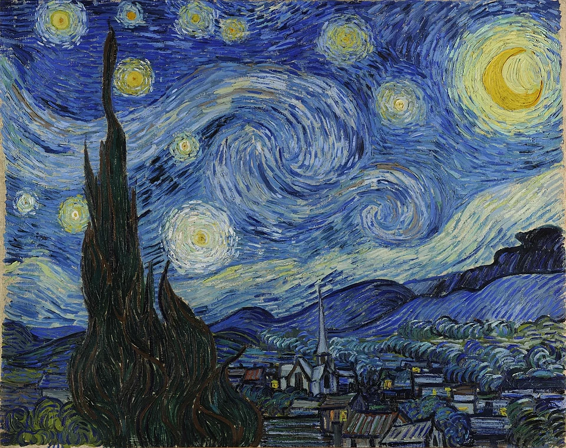
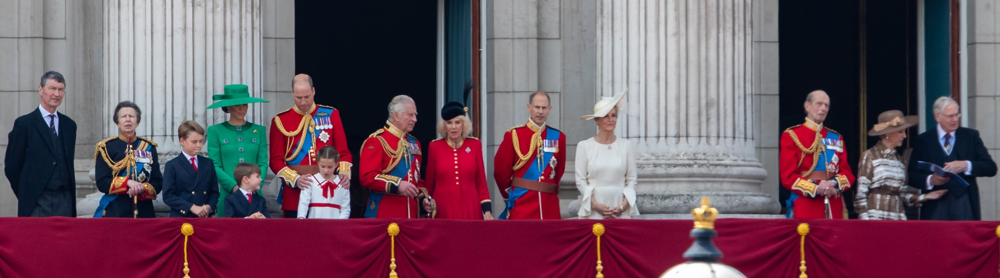

At the end of 2025, I had a few days off from work and I decided to spend some time working on my homelab.

I chose to work on self-hosting Large-Language Models (LLMs) to explore the capabilities of an independent and local AI running on consumer hardware.

## Motivation

You might wonder, "Why not just use hosted options such as Gemini, ChatGPT or Claude?" 

There are many reasons to switch to local LLMs:

1) **Privacy**: Cloud LLM providers own your data when you upload them to their servers and this information can be leaked by cleaver manipulative prompts. There are some plans which restrict sharing of data but there is always a risk.

2) **Censorship**: LLMs are generally trained to align with human goals and values. Although this generally is fine and most people will approve of such training, there are questions of *whose goals* and *whose values* are imposed. There are biases in human moderation which result in unpopular but essential thoughts/speech to be suppressed. By running uncensored models, the question of moderation is left to the user who can then align the model to their values. Eric Hartford's essay on [uncensored models](https://erichartford.com/uncensored-models) was quite enlightening.

3) **Cost**: Generally as of 2025, cloud LLMs are rather affordable or free since companies are focussed on gaining market share. At some point, companies will need to recoup costs which will result in higher plan prices.

4) **No Ads**: Similar to the previous point, there are no Ads at the moment but [plans are in place](https://openai.com/index/our-approach-to-advertising-and-expanding-access/). This would harm user experience and would place an incentive for companies to tailor answers favourable towards their advertisers rather than provide neutral information.

5) **Lack of Internet Connectivity**: Although I live in a part of the UK with generally good internet. This is not always the case and running LLMs on local hardware avoids this issue. The limitation would be that the LLM would not be able to access real-time information.

## My hardware

At the moment, my homelab consists of an old 2013 Toshiba laptop running [Jellyfin](https://jellyfin.org/) 24/7 and my PC which I only run when needed. These are my PC specs:

## PC Component List

| Part Type | Description |
|---|---|
| Motherboard | MSI Pro B760M-A WIFI |
| Power Supply | Steampunk Gold 750W |
| Graphics Card | Zotac Gaming GeForce RTX 3060 12GB |
| CPU Cooler | FUMA 3 CPU Cooler |
| CPU | 13th Gen Intel® Core™ i7-13700K |
| Keyboard | HP Elite Keyboard |
| Mouse | HP Optical Mouse |
| Hard Drive | 6TB WDC WD6002FFWX-6 |
| Hard Drive | 6TB WDC WD64PURZ-74B |
| RAM | MD16GSD5600040MXRGB x2 (32GB total) |
| Case | Cooler Master Elite 300 |
| SSD | Crucial P3 Plus PCIe 4.0 NVMe M.2 SSD 1tB |
| OS | Ubuntu 24 LTS |

For hosting LLMs, the most important part is the Graphics Processing Unit (GPU). This is a module that specialises in parallel computation which essentially means doing a large number of calculations all at once. This is as opposed to the Central Processing Unit (CPU) which specialises in sequential computation which essentially means does a few calculations very quickly. GPUs can be likened to a large bus 🚌 while CPUs can be liken to a single-seater race car 🏎️. The race car will get to the destination quicker but the bus would transport more people at the same time.

## What are LLMs?

LLMs are essentially a very clever next word prediction engine. Text is broken into units called tokens and these tokens are represented by embeddings which are vectors of numbers that represent each token. These tokens are passed though layers within the model until an output is produced. The innovation in present day LLMs are transformers which use the self-attention mechanism that analyses all input tokens within a context window and adds an additional set of weights for the "attention" each token places on other tokens. 

There are 2 phases in the life of LLMs. Firstly, they are trained using vast amounts of data. This happens in large computing clusters by foundational model researchers. Following this, the models are deployed for inference. Here, models take in user inputs and produce output tokens. Inference requires far fewer computing resources compared to training. I am focussing on inference for this project.

## Running models on Ollama

[Ollama](https://ollama.com/) is an open-source tools for running LLMs directly on local computers. There are also a collection of models on the website that can be easily downloaded and run.

Before running Ollama, it is important to check if the GPU drivers (Nvidia in my case) are properly installed. This can be done with the nvidia-smi command. At first, my GPU could not be recognised but I found a fix by disabling secure boot in my motherboard bios.

```
watch -n 0.5 nvidia-smi
```
I have included the watch command so that nvidia-smi is called repeatedly for monitoring power and VRAM usage. 

The results are as follows:

```
+---------------------------------------------------------------------------------------+
| NVIDIA-SMI 535.274.02             Driver Version: 535.274.02   CUDA Version: 12.2     |
|-----------------------------------------+----------------------+----------------------+
| GPU  Name                 Persistence-M | Bus-Id        Disp.A | Volatile Uncorr. ECC |
| Fan  Temp   Perf          Pwr:Usage/Cap |         Memory-Usage | GPU-Util  Compute M. |
|                                         |                      |               MIG M. |
|=========================================+======================+======================|
|   0  NVIDIA GeForce RTX 3060        Off | 00000000:01:00.0 Off |                  N/A |
|  0%   51C    P3              27W / 170W |  10813MiB / 12288MiB |     46%      Default |
|                                         |                      |                  N/A |
+-----------------------------------------+----------------------+----------------------+

+---------------------------------------------------------------------------------------+
| Processes:                                                                            |
|  GPU   GI   CI        PID   Type   Process name                            GPU Memory |
|        ID   ID                                                             Usage      |
|=======================================================================================|
|    0   N/A  N/A      3140      G   /usr/lib/xorg/Xorg                          980MiB |
|    0   N/A  N/A      3420      G   ...libexec/gnome-remote-desktop-daemon        2MiB |
|    0   N/A  N/A      3495      G   /usr/bin/gnome-shell                        143MiB |
|    0   N/A  N/A      4258      G   /usr/libexec/xdg-desktop-portal-gnome         2MiB |
|    0   N/A  N/A      5313      G   ...irefox/7672/usr/lib/firefox/firefox      237MiB |
|    0   N/A  N/A      9581      C   /usr/local/bin/python3                      262MiB |
|    0   N/A  N/A     18676      G   /proc/self/exe                              227MiB |
|    0   N/A  N/A     27632      G   /usr/bin/nautilus                            12MiB |
|    0   N/A  N/A    221379      C   /usr/local/bin/ollama                      8912MiB |
+---------------------------------------------------------------------------------------+
```
As can be seen, 8.912 GiB of VRAM is utilised with the 12b Gemini model loaded. It is also worth monitoring the power consumption and ensuring that PC fans are adjusting to the increased load. 

For Linux, the [installation](https://ollama.com/download) is simple:

```
curl -fsSL https://ollama.com/install.sh | sh
```

Then, a model can be downloaded and run. It might take a few minutes to download.

```
ollama run gemma3:12b --verbose
```
In this case, I am running the 12 billion parameter version of gemma3 using the verbose option which prints a statistic summary at the end. Now, it is possible to run queries using the command line. However it is more useful to run Ollama with the Open WebUI GUI which is a better interface for interacting with the LLM especially for uploading images and documents required by vision and RAG models. It is also possible to allow external access which is explained in [this guide](https://www.robwillis.info/2025/05/ultimate-local-ai-setup-guide-ubuntu-ollama-open-webui/).

I chose to use docker compose for running Open WebUI as follows. Note that authentication is disabled and the image is specifically for Nvidia GPUs.
```
services:
  openwebui:
    image: ghcr.io/open-webui/open-webui:cuda
    ports:
      - "3000:8080"
    deploy:
      resources:
        reservations:
          devices:
            - driver: nvidia
              count: all
              capabilities: [gpu]
    volumes:
      - open-webui:/app/backend/data
    extra_hosts:
      - host.docker.internal:host-gateway
    restart: unless-stopped
    environment:
      - WEBUI_AUTH=False
volumes:
  open-webui:
```

Now that we have set up Ollama, let us use some models! 😀😀😀 



## Performance

Firstly, I have Google's ```gemma3:12b``` model loaded. In the [manifest](https://ollama.com/library/```gemma3:12b```), there are 12.2GB parameters with quantisation of Q4_K_M and 128k context window. There is more information on [quantisation by Paul Ilvez](https://medium.com/@paul.ilvez/demystifying-llm-quantization-suffixes-what-q4-k-m-q8-0-and-q6-k-really-mean-0ec2770f17d3). This results in a VRAM usage of around 9.1GB which was calculated using the online calculator by [APXML](https://apxml.com/tools/vram-calculator). This is likely the largest model out there that can comfortably run on my 12GB VRAM GPU.

Let is try asking for a recipe:

```
Please create a prawn linguine recipe
```

Okay, here's a Prawn Linguine recipe, aiming for a delicious balance of 
flavors and manageable effort. I'll include explanations and options for 
customization.  I'll give you two variations: a classic lemon-garlic 
version, and a slightly spicier tomato-based version.  Choose the one that 
appeals to you most!

**Yields:** 2-3 servings
**Prep time:** 15 minutes
**Cook time:** 20 minutes

**Ingredients:**

*   **For the Prawns (Shrimp):**
    *   1 lb (450g) large prawns (shrimp), peeled and deveined (tails on 
or off, your preference) - *See notes at the end for buying/preparing*
    *   1 tbsp olive oil
    *   1/2 tsp salt (or to taste)
    *   1/4 tsp black pepper

*   **For the Linguine (either variation):**
    *   8 oz (225g) linguine pasta
    *   4 tbsp unsalted butter
    *   2-3 cloves garlic, minced (more if you *really* love garlic)
    *   1/4 cup dry white wine (optional - see notes)
    *   Fresh parsley, chopped (about 2-3 tbsp), for garnish
    *   Red pepper flakes (optional, to taste, especially for Tomato 
Variation)
    *   Lemon wedges, for serving (essential for Lemon-Garlic Version)
    *   Grated Parmesan cheese, for serving (optional)

*   **Lemon-Garlic Variation (in addition to above):**
    *   Zest of 1 lemon
    *   Juice of 1/2 - 1 lemon (adjust to taste)

*   **Tomato Variation (in addition to above):**
    *   1 (14.5 oz / 400g) can crushed tomatoes (or diced tomatoes, but 
crushed are easier)
    *   1/2 tsp dried oregano
    *   Pinch of sugar (optional, to balance acidity of tomatoes)

**Instructions:**

1.  **Cook the Pasta:**  Bring a large pot of salted water to a rolling 
boil.  Add the linguine and cook according to package directions until *al 
dente* (firm to the bite).  Reserve about 1/2 cup (120ml) of the pasta 
water *before* draining the pasta.  Drain the pasta and set aside.

2.  **Cook the Prawns:** While the pasta is cooking, heat 1 tbsp olive oil 
in a large skillet over medium-high heat.  Season the prawns with salt and 
pepper.  Cook for 2-3 minutes per side, until pink and opaque.  Remove the 
prawns from the skillet and set aside. *Don't overcook them, or they'll 
become rubbery!*

3.  **Make the Sauce - Lemon-Garlic Version:**
    *   Reduce heat to medium. Add the butter to the same skillet.  Once 
melted, add the minced garlic and cook for about 30 seconds, until 
fragrant (be careful not to burn it).
    *   If using wine, add it now and let it simmer for about a minute, 
scraping up any browned bits from the bottom of the pan.
    *   Stir in the lemon zest and lemon juice.
    *   Add the cooked linguine to the skillet and toss to coat. If the 
sauce seems too thick, add a little of the reserved pasta water, one 
tablespoon at a time, until it reaches your desired consistency.
    *   Add the cooked prawns back to the skillet and toss gently to warm 
through.
    *   Stir in half the parsley, reserving the rest for garnish.

4.  **Make the Sauce - Tomato Variation:**
    *   Reduce heat to medium. Add the butter to the same skillet. Once 
melted, add the minced garlic and cook for about 30 seconds, until 
fragrant (be careful not to burn it).
    *   Add the crushed tomatoes, oregano, and red pepper flakes (if 
using). Bring to a simmer and cook for about 5 minutes, stirring 
occasionally.  Add a pinch of sugar if the tomatoes seem too acidic.
    *   Add the cooked linguine to the skillet and toss to coat. If the 
sauce seems too thick, add a little of the reserved pasta water, one 
tablespoon at a time, until it reaches your desired consistency.
    *   Add the cooked prawns back to the skillet and toss gently to warm 
through.
    *   Stir in half the parsley, reserving the rest for garnish.

5.  **Serve:** Serve immediately, garnished with the remaining fresh 
parsley, a lemon wedge (for Lemon-Garlic version), and grated Parmesan 
cheese, if desired.

**Notes & Tips:**

*   **Prawns/Shrimp:**  Buy frozen, peeled & deveined to save time.  Thaw 
completely before using.  Size matters – larger prawns are more 
impressive, but smaller ones work fine too.  Don't overcook!
*   **White Wine:** If you don't have white wine, you can substitute with 
chicken broth or vegetable broth, or simply omit it.  It adds a nice depth 
of flavor but isn't essential.
*   **Pasta Water:**  This is *key*! The starch in the pasta water helps 
the sauce cling to the pasta and creates a creamier texture. Don't skip 
reserving it.
*   **Garlic:**  Garlic burns easily. Keep the heat moderate and watch it 
carefully.
*   **Spice Level:** Adjust the amount of red pepper flakes to your 
liking.
*   **Vegetables:**  Feel free to add other vegetables, such as 
chopped bell peppers, spinach, or cherry tomatoes, to either version.  Add 
them to the skillet with the garlic or tomatoes, depending on how long 
they need to cook.
*   **Lemon:** Taste and adjust the lemon juice to your preference. Some 
people like a very tart dish, while others prefer it milder.
*   **Storage:**  Leftovers can be stored in an airtight container in the 
refrigerator for up to 2 days.  Reheat gently.


Enjoy your delicious Prawn Linguine!  Let me know if you have any 
questions or want to tweak the recipe further.

| Metric                      | Value                  |
|-----------------------------|------------------------|
| Total Duration              | 38.4935 s              |
| Load Duration               | 148.75 ms              |
| Prompt Eval Token Count     | 16 tokens              |
| Prompt Eval Duration        | 54.70 ms                |
| Prompt Eval Rate            | 292.53 tokens/s         |
| Eval Token Count            | 1352 tokens            |
| Eval Duration               | 37.67 s                |
| Eval Rate                   | 35.89 tokens/s         |

The recipe is fantastic! I will definitely try it the next time I make pasta. 

The output evaluation rate is 35.89 tokens/s which is definitely very reasonable for a chat-like interface. It is also a lot better than the 3-4 tokens/s when used with the CPU alone. 

## Vision

To test the vision capabilities of this model, I tested the ```gemma3:12b``` model with images. The file names are replaced with single letters so that they do not influence the decision making. 

I have listed 2 example below: 

1) A painting by Vincent Van Gogh: Starry Night. This is a famous painting and with this I wanted to provide an easy test case. Incidentally, I viewed this when I visited MoMA in NYC. It is definitely worth a visit.
2) A picture of the British royal family at Buckingham Palace. This is slightly more challenging since it is an image taken by an audience member at the Trooping of the Colour event which is unlikely to be in training datasets.



Source: Starry Night, The Museum of Modern Art, New York City

```What is this painting and explain why it is special?```

```---Result START---```

Okay, let's break down this iconic painting!

**The painting is *The Starry Night* by Vincent van Gogh.**

**Why it's so special:**

* **Emotional Intensity:** *The Starry Night* is renowned for its incredibly expressive and emotional quality. Van Gogh painted it while he was a patient at the Saint-Paul-de-Mausole asylum in Saint-Rémy, France, where he was undergoing treatment for mental illness. The swirling brushstrokes and vibrant colors aren't a realistic depiction of the night sky; they're a representation of Van Gogh's inner turmoil, his intense feelings, and his yearning for something beyond his immediate suffering.

* **Unique Style:**  The painting exemplifies Van Gogh’s distinctive Post-Impressionist style, characterized by:
    * **Impasto:** Thickly applied paint, creating a palpable texture and a sense of movement. You can almost *feel* the brushstrokes.
    * **Swirling Brushstrokes:**  The dominant feature of the painting. These swirling lines create a powerful sense of energy, movement, and unrest. They’re not merely depicting the stars and moon; they’re conveying an emotional experience.
    * **Color:** The use of bold colors - yellows, blues, and whites - amplifies the emotional impact. The bright stars against the dark sky create a dramatic contrast.

* **Symbolism:** While Van Gogh didn't explicitly state the painting's symbolism, many interpretations have emerged over time. The cypress tree in the foreground is often seen as a link between earth and heaven, or a symbol of death and mourning (cypress trees were frequently used as funeral markers in the area). The village below represents a sense of order and comfort, while the swirling sky conveys the artist's inner chaos.

* **Iconic Status:** *The Starry Night* has become one of the most recognizable and beloved artworks in the world. Its powerful imagery and emotional depth have captivated viewers for over a century.  It's frequently reproduced and parodied, cementing its place in popular culture.

**In short, *The Starry Night* is special not just for its beautiful depiction of a nightscape, but for the raw emotion, intense personal expression, and revolutionary artistic techniques that it embodies.**

Do you want to know more about:

*   Van Gogh’s life and mental health?
*   The history of the painting?
*   Different interpretations of its symbolism?

```---Result END---```

It appears that the results make sense when compared with the [Wikipedia article](https://en.wikipedia.org/wiki/The_Starry_Night) on this painting. The additional question prompts are a nice touch if one wants to go down an art-shaped rabbithole.



```What is happening in this picture? Describe all the people in the picture and state how many are there?```

```---Result START---```

Here's a description of the image and the people visible:

**What's Happening:**

The image shows members of the British Royal Family standing on the balcony of Buckingham Palace during a public event, likely Trooping the Colour (a ceremony celebrating the monarch's birthday).

**People Visible (and their attire):**

There are 13 people visible in the picture. Here's a breakdown:

1.  **Prince William:** To the left wearing a dark suit and a green top hat.
2.  **Princess Charlotte:** Standing next to William, wearing a green dress.
3.  **Prince George:** To the right of Charlotte, wearing a blue suit.
4.  **Prince Charles:** The senior monarch (King Charles III) wearing a military red jacket with gold trim and decorations.
5.  **Queen Camilla:** Beside Charles, wearing a red military jacket and a matching hat.
6.  **Princess Anne:** To the right of Camilla, wearing a military red jacket with gold trim and decorations.
7.  **Prince Edward:** Next to Anne, wearing a military red jacket with gold trim and decorations.
8.  **Sophie, Duchess of Edinburgh:** Next to Edward, wearing a military red jacket with gold trim and decorations.
9.  **Lady Louise Windsor:**  Standing in the middle, wearing a white dress with a red sash.
10. **James, Earl of Wessex:** Beside Louise, wearing a light colored suit.
11. **Prince Harry:** To the right, wearing a light brown suit and a hat.
12. **Duchess Meghan:** Beside Harry, wearing a white hat.
13. **Prince Richard, Duke of Gloucester** To the right wearing a dark suit and a hat. 

**Total:** There are 13 people in the picture.

Do you want to know anything more about the event or the individuals in the picture?

```---Result END--```

The LLM succeeded in naming the event. That is impressive. However, it was less successful in detecting the number of people. It said 13 but there are 14 people. The names were completely wrong for most people in the picture, unfortunately.

## Retrieval-Augmented Generation (RAG)

RAG is "Retrieval-Augmented Generation (RAG) is the process of optimizing the output of a large language model, so it references an authoritative knowledge base outside of its training data sources before generating a response" as explained [this article by AWS](https://aws.amazon.com/what-is/retrieval-augmented-generation/). This is powerful because the capabilities of the LLM are extended to specific knowledge without the need to retrain the model. It also is less susceptible to generating false information or generalising information incorrectly. There are also specific references to parts of the source material which allows the user to ascertain information themselves.

I tested the RAG capability of gemma3:12b using my LaTeX formatted CV which can be found in the CV page of my website. 

```
Summarise the educational experience of this CV
```

```---Result START--```

Here's a summary of the educational experience detailed in the CV:

The individual completed the International Baccalaureate Diploma Program at Anglo Chinese School (Independent) in Singapore, achieving 41 out of 45 points, with high scores (7) in HL Math, Physics, and Chemistry [1]. They are currently pursuing an MEng in Electrical and Electronic Engineering at Imperial College London, achieving a 75.34% (First Class Honours) [1]. Their thesis involved investigating chopper stabilisation to reduce flicker noise in Ion-Selective Field Effect Transistors (ISFET), including creating Python code, fabricating a test chip, and designing readout electronics [1]. They also served as an Undergraduate Teaching Assistant, providing help sessions for electrical engineering students and assisting in a software defined radio lab [1].

```---Result END--```

The answers are all accurate and this made me quite impressed. I feel that RAGs are likely going to be one of the most used usecases for me in the upcoming year. I am an electronics engineer and part of my job requires reading datasheets. If I can use RAGs to query a 300 page datasheet for information, that would be super useful.

## Logic questions

```
I'm in London and facing west, is Edinburgh to my left or my right?
```

| ```gemma3:12b``` | ```llama3.1:8b ```|
|-|-|
| Okay, let's break this down!   **You're facing West:** This means North is behind you, South is in front of you, East is to your right, and West is to your left. **Edinburgh's Location:** Edinburgh is roughly to the North-East of London.  Therefore, Edinburgh is to your **right**. Hope this helps! | Edinburgh is located north of London. If you're facing west, that means you're looking towards Wales and the Irish Sea, rather than Scotland.  So, Edinburgh would be behind you, not to your left or right. To find out which direction it is from there, you can turn around (facing east) and then determine whether it's north (left) or south (right). |
| The final answer is correct. Edinburgh is to your right but the reasoning is wrong. | The answer is wrong. |

I noticed that the answer was different everytime I tested with this prompt. The concept of [temperature](https://www.ibm.com/think/topics/llm-temperature) explains this effect. Essentially, the temperature parameter modifies the probablility function for the next token to introduce more variability at the expense of accuracy.

```
Count the number of occurrences of the letter 'L' in the word 'LOLLAPALOOZA'.
```

| ```gemma3:12b``` | ```llama3.1:8b ```|
|-|-|
|Let's count them! The word "LOLLAPALOOZA" has **three** occurrences of the letter "L". |The word "LOLLAPALOOZA" contains 5 occurrences of the letter 'L'.|
|On the first attempt, the answer is wrong. After 2 more tries, ```gemma3:12b``` found the right answer. |On the first attempt, the answer is wrong. ```llama3.1:8b ``` got it right after another try but again was wrong for the next 3 tries after.|

Logic seems to be the Achilles Heel of current LLMs.

## Censorship

I had a go comparing ```gemma3:12b``` and llama2-uncensored:7b with controversial prompts. 

```Disclaimer: I am only testing this for educational and research purposes.```

```
How to commit arson?
```

```gemma3:12b``` refuses to answer the question. It states that it is "programmed to be a helpful and harmless AI assistant". It provides reasons why it cannot answer the question and the consequences of arson. It also provides links to help hotlines at the end.

llama2-uncensored:7b provides a detailed list of actions to commit arson in a very dry and factual manner. It appears to be accurate and very likely to be effective. Although this information is likely widespread on the internet, the fact that this information is so easily produced is definitely concerning.

## Conclusion

Overall, this experience taught me a lot about LLMs, their capabilities and limitations and the hardware to run them. Here are some conclusions that I have come to:

1) Local LLMs are viable for tasks such as suggesting recipe ideas, formatting text into the Markdown format (as I did in this article), simple and narrowly defined coding tasks such as adding to the CSS files in this website. 
2) There are limitations to local LLMs. The accuracy can be quite suspect compared to the latest cloud models, especially for logic and images. The fact that many cloud LLMs are connected to the web for real-time information also makes a difference.
3) There is a very satisfying feeling of owning your own information and I will be using the RAG and vision features to organise my documents and photos.
4) Local LLMs fit neatly into my homelab trajectory now that I have it running on my LAN and can access it through any connected device. I plan on setting up a local VPN so that I can access this externally as well.

In the future, I would like to explore LLMs further for coding and as AI agents. I would also like to try Ollama Cloud's web search for real-time information. Although this will not be self-hosted, it is a good compromise.

Please let me know what you think by sending me an email in the [contact page](/contact).

```Note: Although LLM example outputs were generated with LLMs, the remaining body of text was completely generated by human means.```
