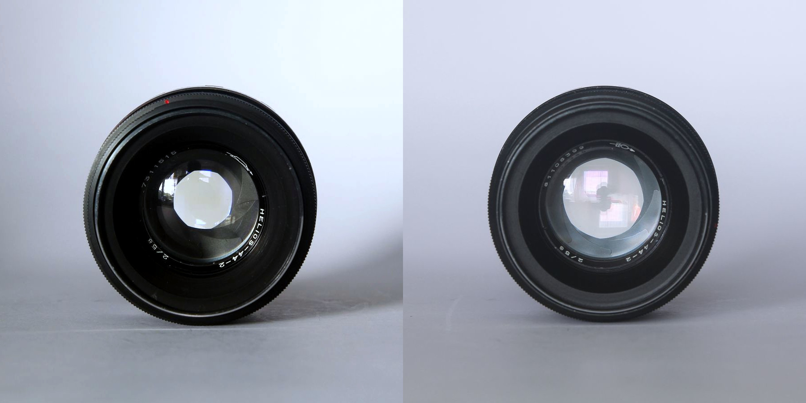
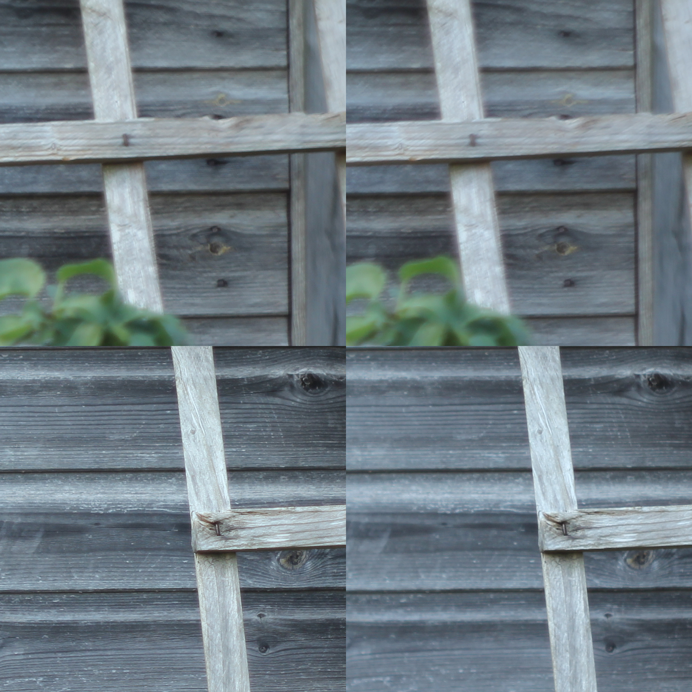
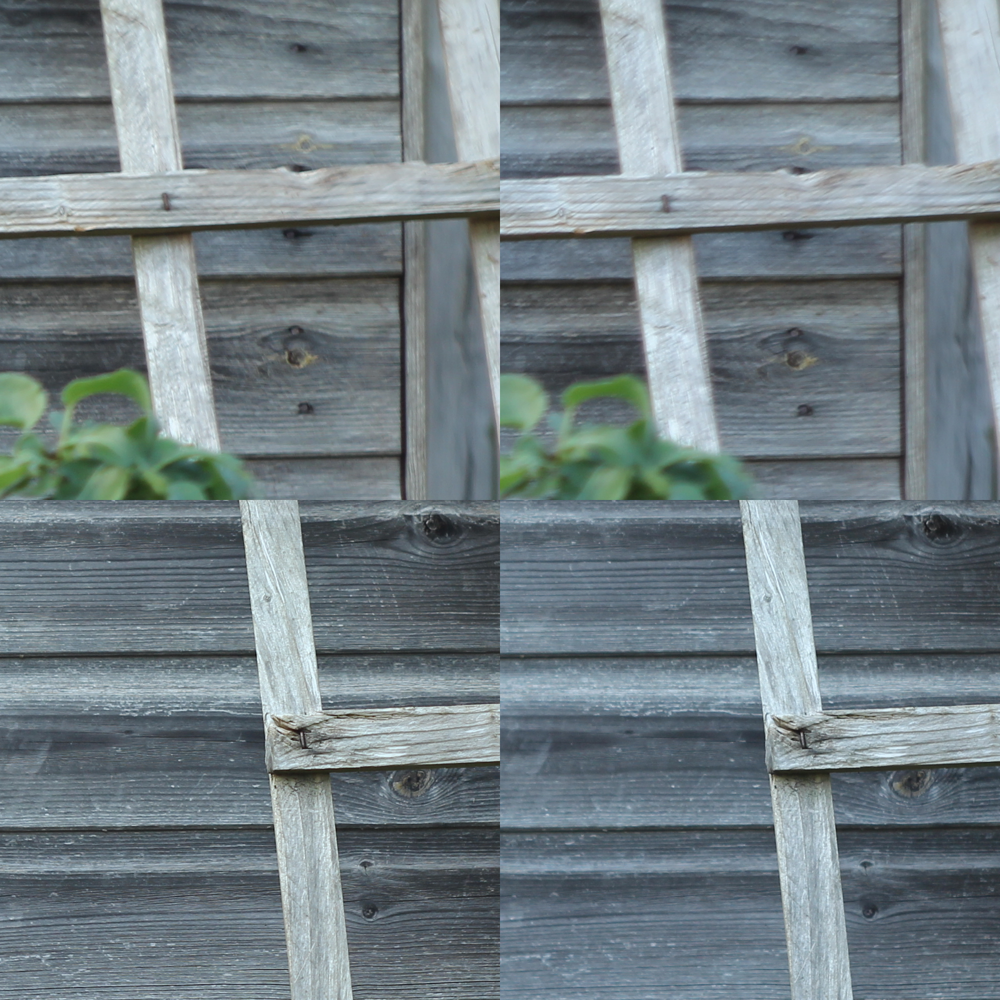
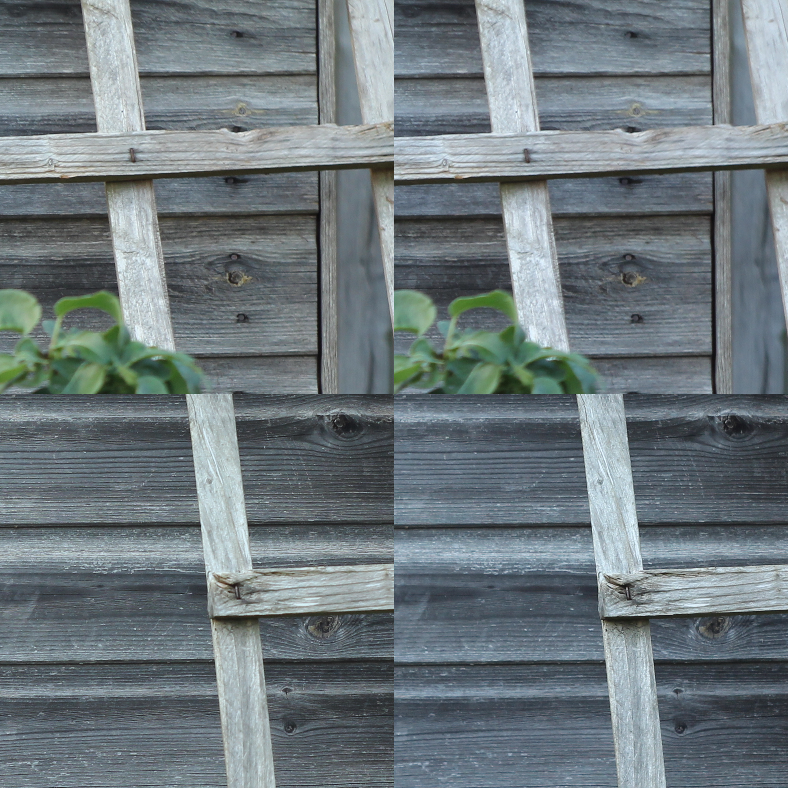

Earlier this month, I came into possession of 2 Zenit E cameras from the Soviet era. The SLRs came with Helios 44-2 lenses which are known for its unusual swirly bokeh in specific conditions. Other than the famed bokeh, these lenses are very interesting portrait lenses due to their quirkiness and everyday lenses.

*Fuchsias showcasing swirly bokeh of the Valdai plant Helios 44-2*

The Helios 44-2 lens was produced in their millions mainly in the [KMZ, BelOMO and Valdai factories.](https://camerapedia.fandom.com/wiki/Soviet_Factory_Logos).  According to a [buying guide created by Retro Foto House](https://www.youtube.com/watch?v=mV3MSfl-NYI), the Valdai lenses are not of the same quality as the other lenses. 

*Front shots of the KMZ (left, identifiable by its logo consisting of a trapezium and rays passing through it) and Valdai (right, identifiable by the arrow passing through a circle and arch) versions of the Helios 44-2 lens.*

The Helios 44-2 from KMZ was made in 1973 while the Valdai version was made in 1981. The appearance is pretty similar and both have very smooth focussing rings with wide throws in order to allow precise focus.

I wanted to test the lenses for sharpness, contrast and chromatic aberrations. As such, I adapted the lenses to my Canon 60D using a M42-EOS adapter (note: this adapter has no lens elements) and shot photos of my shed from a tripod at various apertures. The shed is a good target because it is flat which means that the sharpness at the center and the edge can be tested in the same shot. The shed also contains closely spaced lines which are the challenge to resolve. The white balance is set to daylight and the ISO and shutter speed are set to auto. I do not have access to a full frame camera so the results on an APS-C camera might be generally more optimistic since I will only be capturing a small portion of the image circle. Another caveat is that I am using the focus confirmation from [Magic Lantern](https://www.magiclantern.fm/) in order to nail focus but this may not be 100% effective. A proper test would need multiple samples in each class to get rid of random human variations.

The results are as follows:

*Aperture f2. Top left: KMZ edge, top right: Valdai edge, bottom left: KMZ center, bottom right: Valdai*

At f2, the center of the image is very soft for the Valdai lens. The KMZ lens is soft but still has reasonable resolution. At the edges, both lenses are very soft but its obvious that the Valdai lens is significantly worse.

*Aperture f2.8. Top left: KMZ edge, top right: Valdai edge, bottom left: KMZ center, bottom right: Valdai*

At f2.8, there are significant improvements for both lenses. The KMZ in particular is tack sharp at the center. In my opinion, the sharpness for the KMZ lens is good enough for images of plants or animals where the photographer is trying to get sharp details at the center but the edges do not matter as much.

*Aperture f4. Top left: KMZ edge, top right: Valdai edge, bottom left: KMZ center, bottom right: Valdai center*

At f4, the sharpness of both lenses appears to be similar and very good. My photography is mainly shared on smartphones and therefore being able to zoom into the image and view greater detail is always welcome. I can still see a bit of chromatic aberration in the Valdai lens and the colors seem slightly washed out. 

Overall, it appears that the KMZ lens performs better than the Valdai lens in sharpness, chromatic aberration and contrast. However, it could be down to the quality of these particular lenses copies rather than an average lens from each factory.

Thank you for reading my article. Please let me know your experiences with the Helios 44-2 if you have used them!
