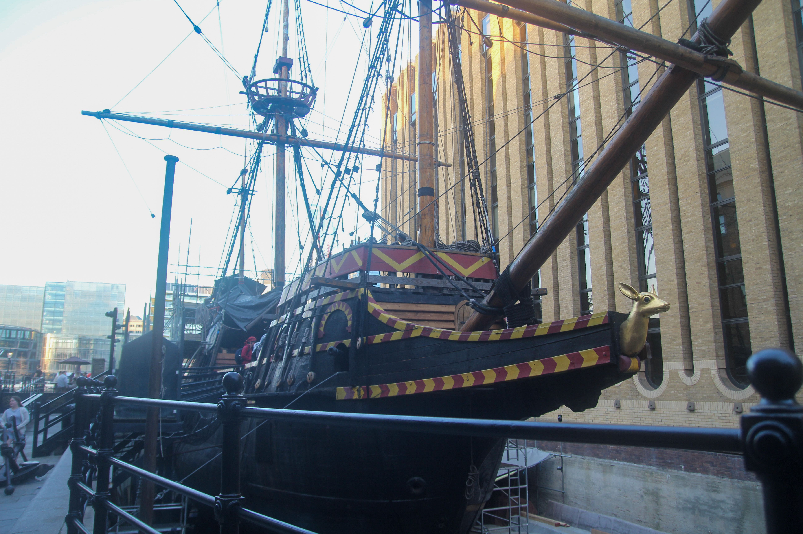

To celebrate the end of term, my friends Prateek, George and I had a stroll around Westminster, South Bank and Southwark. This was my first time here and its was a great opportunity to snap a few photos.

The first stop was the Big Ben at the Palace of Westminster. After months of renovation, the scaffolding has been removed to reveal this shiny marvel.

This is Westminster Abbey where every English or British monarch since William the Conqueror was coronated.

War-time prime minister, Winston Churchill just around the corner from the houses of parliament.

This is Westminster hall which was a famed court of law. Famous cases that took place here include the state trial of William Wallace and Sir Thomas More.

Of course! Who could miss a passionate protest outside the parliament?

A closeup of the London Eye. Interestingly I found that the drive systems are located at the base of the wheel. Initially I thought that they were at the hub.

An interesting skateboarding spot underneath the Southbank Centre.

A street performer on his unicycle. He latter proceeded to remove the tennis racket stuck around his waist. Pretty painful to watch.

At the Tate modern museum, we were treated to amazing displays of art like this one by Cy Twombly. It covers the whole room and is pretty intense.

This work by Picasso in 1909 is entitled "Seated Nude". It has a cubist style meaning that different views of the subject are brought into the same picture.

This is a view of St Paul's Cathedral from the 3rd floor of Tate Modern.

A replica of Shakespeare's Globe Theatre where his plays were performed. It will be awesome to watch a play in the future.

These are the remains of The Great Hall from the palace of the Bishops of Winchester. It is interesting to see the style of brick/stone work over time.

A seaworthy replica of the Galleon that Sir Francis Drake captained his circumnavigation of the globe.

The Shard which is the second tallest free standing structure.

The mighty HMS Belfast which saw action in WWII and the Korean war.

Our final destination! The tower bridge.
