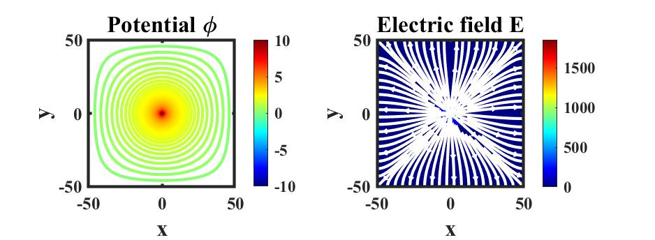
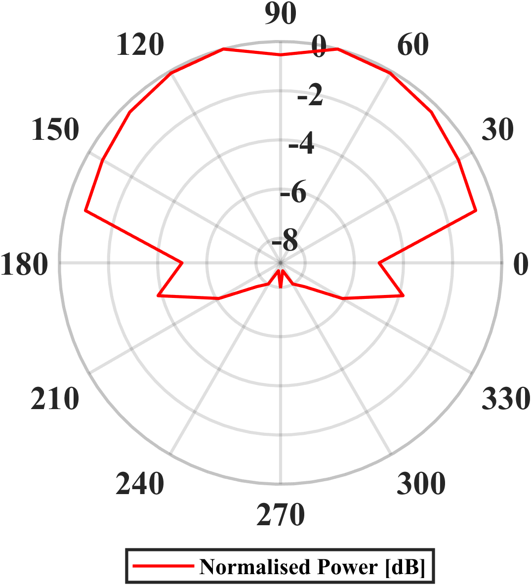
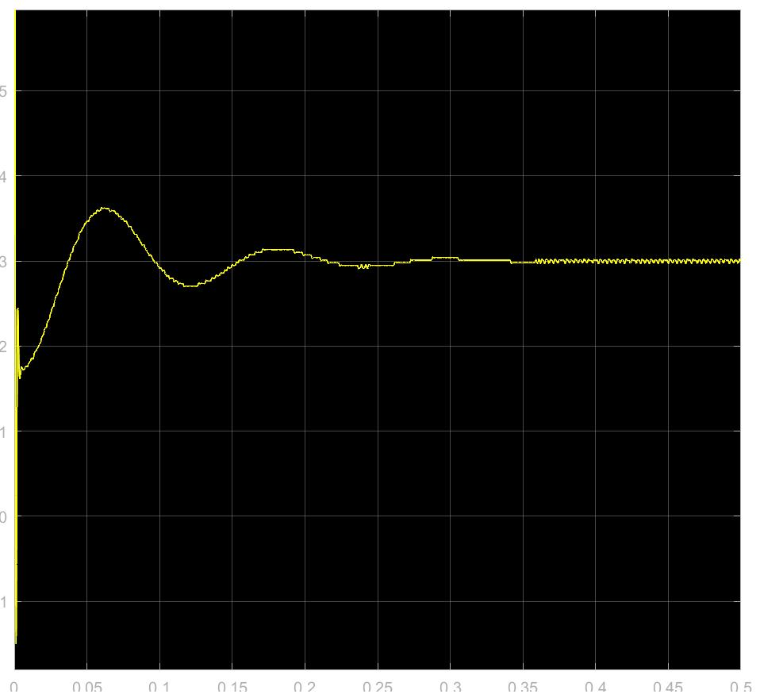
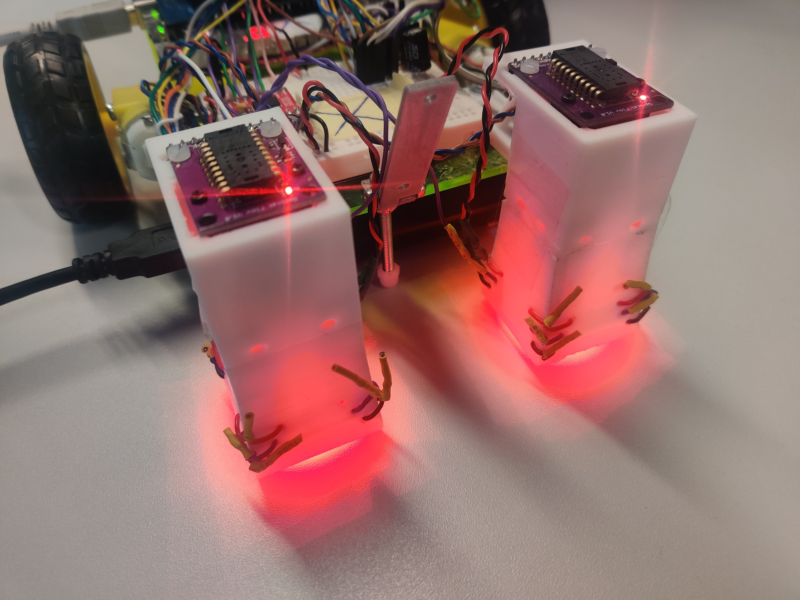
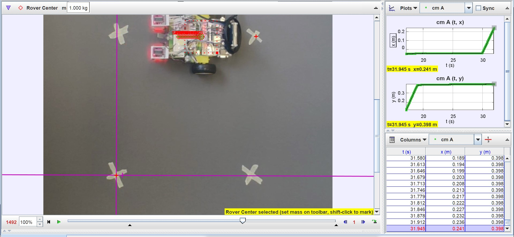
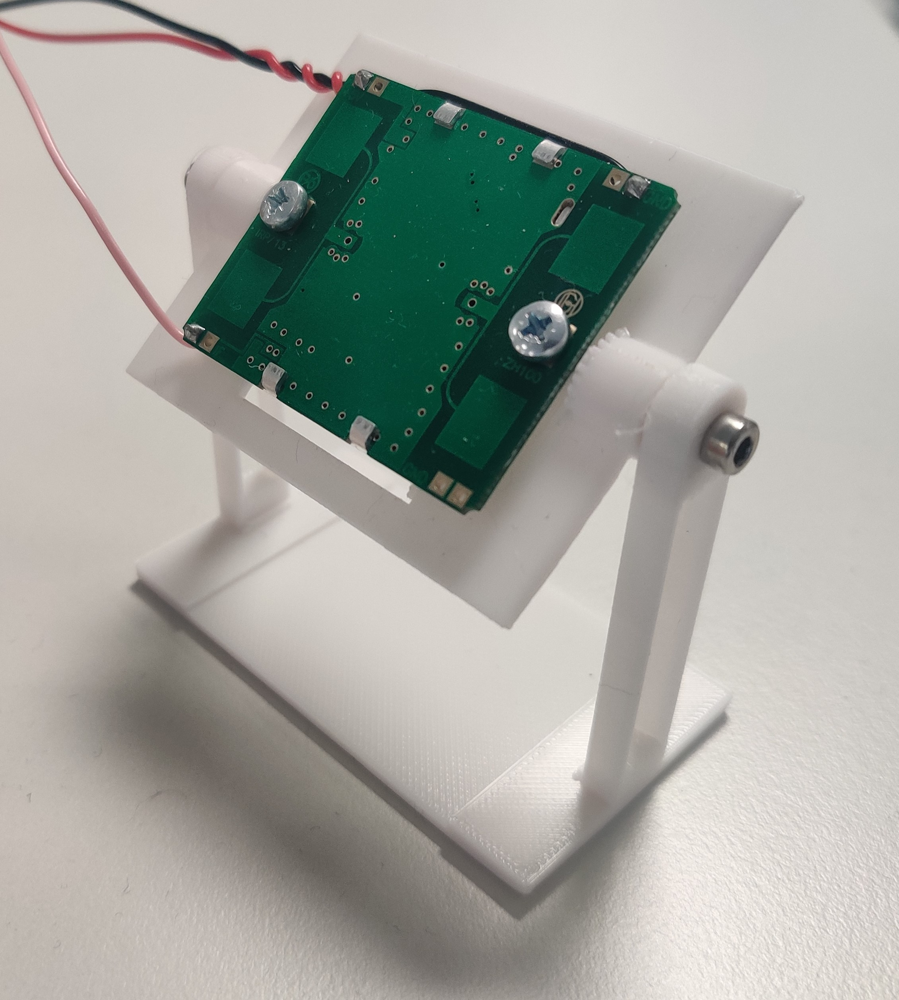
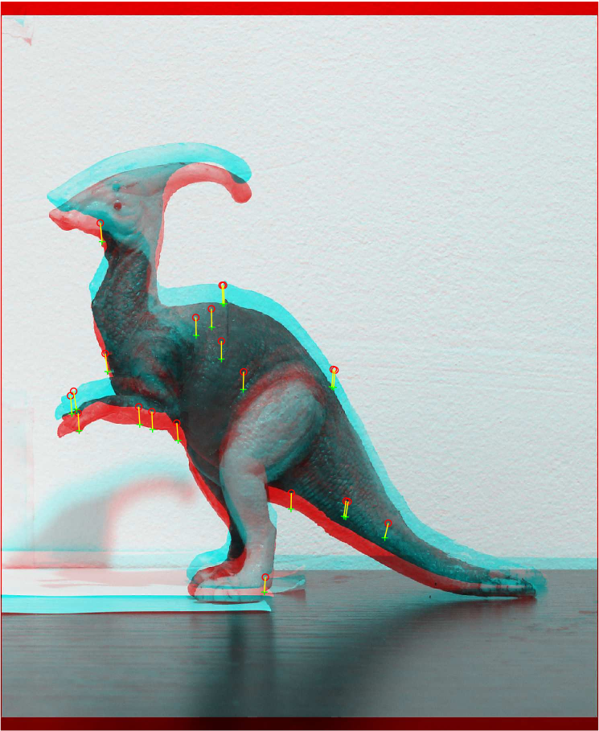
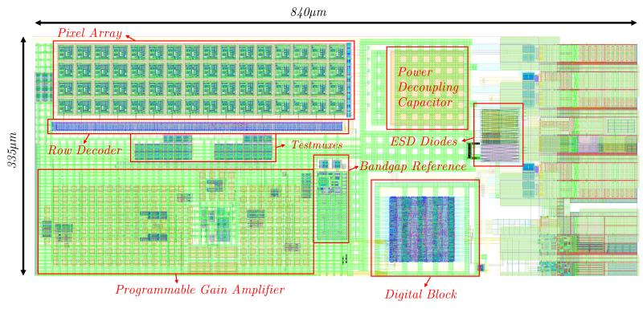
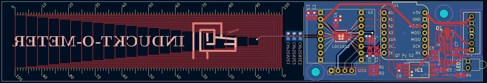

*Imperial College South Kensington Campus. That 12 story building in the middle is the EEE building. Source: www.imperial.ac.uk*

## Year 1
### Analysis and Design of Circuits 67.50%
This module is a 2 term module that covers the basics of electrical engineering. The first term focuses on a number of very fundamental concepts. These include  nodal analysis which is finding voltage potentials at different nodes of the circuit by creating algebraic equations, frequency responses which look analysing the phase and magnitude of signals at different frequencies and operational amplifiers which is a device that multiplies the difference between 2 inputs and can be used in many different applications such as feedback systems and filters. The lab involved creating circuits with opamps and measuring voltages using an oscilosope.

  
 *This setup is a summing amplifier that adds 2 signals and feeds the output to a speaker.*
 
 The second term focusses on transistors which are semiconductor devices that regulates current/voltages. There are 2 forms of transistors that we studied: MOSFETs and BJTs. Our lab involved first creating circuits using a BJT and then designing an opamp using the LTSpice simulator.

 
 *Complete design of the opamp*

### Digital and Computer Architecture 72.72%
Digital electronics covered the basics of digital logic, which is the study of computers at a binary level. It included truth tables, Boolean algebra and finite state machines. Our lab work involved using a circuit simulation software called ISSIE to simulate digital logic such as multiplexer, adders and counters. For the final project, we created a simple vending machine system using a finite state machine. The simulation software was pretty buggy and frustrating to work with. However eventually the professor fixed these issues. For computer architecture, we created a [simple arm-based virtual CPU](https://intranet.ee.ic.ac.uk/t.clarke/arch/deca/). 

 *ISSUE diagram of MU0 CPU architecture* 

I was really proud that we could run simple programs on this virtual CPU. Overall, I really enjoyed this course but the computer architecture part was difficult to understand at first because there were so many new terms .

### Mathematics 1A 61.00% and Mathematics 1B 69.18%
We learnt about complex numbers, calculus, differential equations, multivariable calculus, sequences and series, fourier series and transforms, vectors, linear algebra and other topics. Although this module was designed to cater to students of different educational backgrounds, I felt a little lost for some topics such as differential equations since it was not taught in IB HL math. Also, my time management in the first exam was poor which caused me to perform poorly. However, with a lot of practice, I managed to do decently in the final exam. Overall, I feel that learning math is really essential for nearly every other part of electrical engineering.

### Programming for Engineers 81.35%
This course covered the fundamentals of programming for beginners and was taught in C++. We learnt about some data structures like binary trees and vectors as well. Although I had some programming experience before, I really enjoyed this module and learning such a low level language.

### Topics in Electrical Engineering 74.10%
This module consists of 4 smaller modules covering PN diode, power electronics, waves and signals and communications. It was designed to give students a flavor of electrical engineering. Power electronics was my favorite submodule perhaps because the lecturer was really enthusiastic about his subject. The problems were also not too difficult after a bit of practice. PN diodes was fairly difficult since it covered a huge about of content in half a term. To be honest, I still do not understand a large portion of the content but the exam was restricted to some core concepts. Overall, I enjoy this topic since it delves into physics and hope to explore it in the future.

### Electronics Design Project 1 86.22%
We formed a group of 3 and chose the analog music synthesizer project to work on. I have written about this project in [another article](/project/analog-music-synthesizer-simulation). This project was very open ended apart from a few guidelines. We worked very hard on the project and report and ended up winning the best project in this category! I believe it was down to having good team effort and documentation. Having to work entirely online and with people in 3 different time zones was strange but we coped pretty well.

### German Level 1 Pass with Merit
At Imperial, we are given the opportunity to take an additional module in the humanities or languages. I chose to try learning German as it seemed like an interesting challenge. I enjoyed meeting people outside of my department and learning something beyond engineering and math. 

## Year 2
### Circuits and Systems 77.20%
Circuits and systems carries on from the ADC module in first year. We were introduced to the non idealities of opamps such as finite gain and settling time. We also had a chance to program with a DE10 Lite FPGA board and create circuits to interface the FPGA with analog circuitry such as DACs, ADCs and opamps. FPGAs are programmable chips which allows the programmer to create digital circuits using the Verilog Hardware Description Language.

*Verilog code for counter with reset*

### Communications 75.92%
The module starts of with analog communication such as amplitude modulation (AM), frequencies modulation (FM) and phase modulation (PM). We also learnt about the presence of noise in communication channels and calculating relative signal to noise ratios. The second half of the module moves on to digital communication techniques such as amplitude shift keying (ASK), frequency shift keying (FSK) and phase shift keying (PSK). Finally we were introduced to information theory and coding. The lab for this module used software defined radios to try out different communication schemes. To program this radio, we used NI Labview.

*Example of labview code taking the average of 100 random numbers*

### Control Systems 73.13%
I think the summary of the module from the notes explains it well: "To impose a given time-trajectory to one or more specific variables of an engineering system by acting on other variables that influence the behaviour of the system itself". The module first starts by exploring dynamic systems and describing them with mathematical equations. We then explored stability and the linear algebra required for control systems. Towards the end of the module, we explored designing controllers to meet specifications and the digital implementation of control systems. The lab for this module was a [ANT-X 2 degree of freedom drone](https://ant-x.gitlab.io/documentation_2dofdrone/_chapters/intro.html) for testing out implementing control systems. It was a challenging lab because of the limited time and technical issues with the drones but in the end it was interesting to implement a PID system in real-life.

### Electromagnetism 73.21%
This was the first electromagnetism module at university. The first section introduces fields and vector calculus which is essential to understanding the rest of the module. The next section introduces Maxwell's equations which describes electomagnetic phenomena. This allowed us to calculate electric and magnetic fields and then move on to capacitance and inductance. Most of the examples were for simplified structures such as lines and spheres. We then explored the numerical approach for calculating potential in a grid. The next section looks at engineering with electromagnetism such as transmission lines, s-parameters and radio systems. 

The lab was split across 2 terms. In the first term, we did Matlab simulations of electric field and magnetic fields.

*Potential and electric field of a static positive charge with grounded enclosure*

In the second term, we used a Nano Vector Network Analyser (VNA) to test a series of circuits including coupled inductors, splitters, transmission lines and antennas. The capstone was to measure the distance to a right-angled reflector using 2 log-periodic antennas.

*Normalised power radiation pattern of the log period antenna*

Initially, I found the theoretical parts of EM very difficult and struggled but over time they made sense when paired with the labs and problems. The practical lab was very interesting and I did well in the lab although it required many hours of commitment.

### Mathematics for Engineers 53.41%
This modules was split into 2 parts within the same term. The first part of this module was on complex variables for conformational mapping and contour integration and linear transformations, matrix decomposition and computation with matrices. The singular value decomposition section was very interesting and useful for other modules. The second part of this module was on probability and statistics. 

I did not prepare well for the exam and did quite poorly. But still, the information from this module has been important for my engineering career.

### Power Electronics and Power Systems 71.09%
This module covers the generation, transmission and application of electrical power. We were introduced to 3 phase power supplies, generators and the national grid. It was very interesting to hear about Prof Tim Green's analysis of power failures that happened in the past and lessons from them. In the induction machine section, we understood how a rotating magnetic flux wave is produced and how torque is generated by the interation of the magnetic fields of the stator and rotor. In the voltage conversion section we explored transformers for AC voltages and Switched-Mode Power Supplies (SMPS). 

The lab was on testing an SMPS. We simulated on Simulink and measured voltages using multimeters. There were many different configurations such as buck or boost mode, continous or discontinous conduction and open or closed loop. I enjoyed working my with my mate George on this lab.

*Output voltage of buck SMPS with closed-loop control*

### Signals and Systems 69.09%
This modules was on the fundamental properties of signals and Linear Time-Invariant (LTI) systems. The effects of sampling and convolution were discussed. The methods of representing signals namely Laplace, Fourier and z-transform were introduced. The final section involved designing linear filters. There was a Jupyter notebook with simple examples to try.

### Engineering Design Project 2 79.45%
We worked in a 7 member group to create a 2-wheel rover designed to autonomously navigate through a simulated Martian surface with obstacles. I contributed towards the drive subsystem by interfacing an optical flow sensor with the ESP32 and tuned an algorithm for precise rotation and linear motion. I also created an analog readout circuit for the doppler radar module. More information can be found [in this article](/project/autonomous-mars-rover/).

These are some things that I am proud of:

*2 optical flow sensor setup with active illumination that we designed to more accurately determine the rotation*

*Position of the rover compared with setpoints as measured by the Tracker software*

*3D printed rig for characterising the HB100 doppler radar module*

### German Level 2 Pass
The second module was at the A2 level and a continuation of the first year module. It featured more complex grammer such as dative case.

## Year 3
### Analogue Integrated Circuits and Systems 62.50%
This was an introduction to analog integrated circuits. Circuits covered included bandgap references, opamp architectures, switched-capacitor circuits, Analog-to-Digital converters and Digital-to-Analog converters. Prof Toumazou taught this module is a very intuitive manner but also mentioned the simplified CMOS model and small signal model when required. 

### Digital Signal Processing 64.33%
This module was a continuation of the signals and system module in second year. We rehashed z-transforms and sampling theory. Other concepts convered were digital filter using Finite Impulse Response (FIR) and Infinite Impulse Response (IIR) design techniques; Bilinear transformation; Short-time spectrum estimation including the Fast-Fourier Transform (FFT) and windowing functions; Multirate signal processing. 

### Digital System Design 74.00%
This module introduces the principles and techniques for designing digital systems. The theory included numerical systems such as floating points and fixed point numbers, system performance characterisation such as latency and throughput and concepts like  pipelining and parallelisation. We also explored FPGA architectures, multiplier circuits, dynamic memory interfacing and DMA control circuits. When implementing the circuits, we considered timing issues such as hazards, metastability and race conditions. 

The lab was an implementation of a function accelerator on an FPGA. This involved optimisation of the cordic algorithm and invoking the hardware block using software in the NIOS II softcore processor. I have written an [article about the project](/project/digital-systems-design-fpga/).

Although we did not achieve the lowest latency, it was very interesting to learn about the EDA tools for FPGAs and think about digital systems logically. Also fantastic to work with my mate George once again.

### Instrumentation 79.00%
This module was on measurement of electrical signals. We first learns about the operation principles and principles of various measurement sensors/transducers for mechanical and electromagnetic stimuli. There was brief mention of quantum sensors such as SQUIDs. We also learnt signal conditioning, noise, readout circuits and digitisation. 

The coursework was on creating a PCB to measure impedances of 2-port devices. We achived this using a auto balancing bridge that was stimulated by direct digital synthesis generated by the DAC in a STM32 microcontroller and voltages read by the ADCs in the same microntroller.

More information on the impedance measurement PCB can be found [here](/project/impedance-measurement-meter/).

### Machine Learning 74.09%
This module was an introduction to machine learning. The module content summary explains this well: 
1) Components of learning, tasks, types of learning, ML problem formulation,simple predictors 
2) Feasibility of learning, error function, Empirical Risk Minimization, generalisationbounds, performance vs complexity, bias/variance trade off, Hoeffding/VC inequalities 
3) Feature transformations, noisy data, overfitting, regularisation 
4) Logistic regression, gradient descent, Perceptron, Multi Layer Perceptron, Neural Network, backpropagation 
5) Hyperplane, separation with hard margin, soft margin, support vector machines, 
6) Nearest neighbour classification, linear unsupervised learning, principlecomponent analysis 
7) K-means clustering, kernel K-means, advanced clustering algorithms

There was a Jypter Notebook component to apply the skills that we learnt in lectures.

### Optoelectronics 68.75%
This module provides and introduction to optoelectronics devices with a focus on optical communication and sensing. It has heavy emphasis on semiconductor physics and Maxwell's equations. Concepts covered included physics of waveguides, optical fibres, wavelength division multiplexing, plana lightwave circuits and semiconductor optoelectronics.

### Real-time Digital Signal Processing 83.40%
The module was focussed on DSP but on systems that run in real time. This required understanding hardware concepts like interrupts, timers and peripherals. We also learnt to design digital filters and implement data conversion. The coarsework was on voice synthesis and more information can be found [here](/project/dsp-voice-synthesizer/).

### Origins: What we have learnt from science about the origin of the world, the Universe and Life Pass
This was a module organised by the physics department but the instructor was on strike most of the time. It was quite interesting to read up on astronomy and biology but it was very low stress in the end.

### Electrical Engineering Industrial Placement 83.07%
This was the placement module. I did my placement at Mediatek in the RF division at Kent. I worked on an intermediate frequency chip designed for a 5G mobile communication platform. I modelled circuit behaviour with Verilog-AMS, ran cosimulations & transistor level simulations and analysed results with scripts. I took responsibility for chip power estimation and current measurement final test sequences for post-silicon testing. In daily verification meetings,I presented results and coordinated with multiple RFIC designers

## Year 4
### Computer Vision and Pattern Recognition 78.66%
The module is a combination of computer vision and pattern recognition. In the computer vision part, we started with the pin-hole camera model and learnt about image geometry and stereo vision. We then learnt about model fitting using classical algorithms and neural networks. In the pattern recognition part, we learnt about dimensionality reduction, principle component analysis, linear discrimination analysis, clustering algorithms, bagging and boosting algorithms, ensemble learning and sequential analysis.

*Transfrom estimation between 2 images*

### Digital Image Processing 85.00%
This module is an extension of the digital signal processing module. The module covers transformations such as the 2D Discret Fourier Transform (DFT), Discrete Cosine Transform (DCT), Walsh-Hadamard transform, Karhunen-Loeve Transform (KLT) before moving on to image enhancement, histogram processing and image filters. The final sections were on image restoration and image compression.

### Full-Custom Integrated Circuit Design 79.93%
This module was on designing a full custom CMOS chip. We did the schematic capture and layout using Cadence Virtuoso. First we started with simple circuits such as inverters, D-FF and opamps. We also did the layout. For the capstone project, we were assigned a Digital to Analog Converter (DAC). I chose to do a 12-bit R2R DAC in GPDK045n. I chose the R2R topology because I was very busy with my final year thesis. The design was only simulated for the typical corner and no post-layout simulation. The workload for this module was fairly heavy. I enjoyed this module because it was very much application based and because I did my placement in the semiconductor field.

*Layout of R2R DAC with annotations*

### Hardware and Software Verification 81.16%
This module was on hardware and software formal verification. In essence, we consider software code to be a series of mathematical statements and use mathematical methods such as induction and invariants to proof the correctness of the code. For software, we completed tasks with Dafny and Isabelle and for hardware we completed tasks with Symbiyosys. As of writing, the [tasks and solutions are available on github](https://github.com/johnwickerson/HSV). Some of these tasks included verifying that an ADC output is always less than the input value and a limited subset of Fermat's Last Theorem. 

It was a tough module since I was very unfamiliar with the declarative paradigm of programming. The syntax also was quite convoluted. However in the end, it was a whole bunch of brain teaser and I enjoyed working with my friend Jeffrey.

### Individual Project 78.07%
The research question was **Investigating chopper stabilisation in reducing flicker noise in Ion-Selective Field Effect Transistors (ISFET)**.

**Abstract**: This project concerns an investigation into noise reduction in Ion-Selective Field Effect Transistors (ISFET). Over the past few years, ISFETs have emerged in many applications including bio-fluid monitoring, disease detection and environmental monitoring. ISFETs suffer from approximately an order of magnitude larger flicker noise relative to MOSFETs and this is detrimental for measuring low frequency chemical and biological signals. Furthermore, long term drift is a significant. The technique of chopper stabilisation is explored to mitigate low frequency noise and drift by modulating the reference electrode, modulating the drain-source voltage, modulating the floating gate using a programmable gate configuration and using a reset switch. To test these techniques, a test platform is designed consisting of a chip designed and taped-out in the CMOS TSMC65n\_LP process using the Cadence suite of tools. Blocks in this design include a pixel array, switched-capacitor amplifier, SPI, clock generator and band-gap reference. Specifications for a test PCB and test sequences are prepared in order to validate the chip.

*Annotated layout of MEng thesis chip*

### Radio Frequency Subsystems 61.60%
This module gives an overview of RF systems at a system level. The lectures contained information on the electromagnetic spectrum, applications of RF systems, S-parameters, architectures, subsystem specifications, power link budgets, couplers, small signal amplifiers and filters.

The coursework in this module involved creating a signal chain using black-box amplifier of various performance parameters to meet the specification of a 2.45GHz repeater design. This system required a bandpass filter which was designed with discrete components and an impedance matching network. The software used was Cadence Microwave Office.

I really enjoyed this module because I developed an interest in RF. I however did quite poorly in the exam because I got stuck at a few derivations and did not answer a few questions.

### Sensors 87.00%
This module was taught by many different lecturers each focussing on a specific type of sensor such as quantum, MEMs, EM and semiconductor sensor. The main part of the module was the coursework which was to create a temperature or inductive position sensor. We created an inductive position sensor which consisted on a stretched coil and LDC1612 inductance to digital converter. Due to the stretched coil, the mutual inductance between the coil and metalic object changes based on the position of the object.

*Front view of the inductive position sensor PCB named Induct-O-Meter :)*

### Ethics and Sustainability Pass
This module consisted of talks such as on sustainability in manufacturing, in climate and health/safety. We also had discussion sessions on case studies involving the topics we discussed. This was a compulsary module that I did not find that useful to be honest. But that year, Imperial became the [top ranked university](https://www.imperial.ac.uk/news/253793/imperial-ranks-second-world-major-university/) in the UK partially due to the increase in sustainability weighting.

