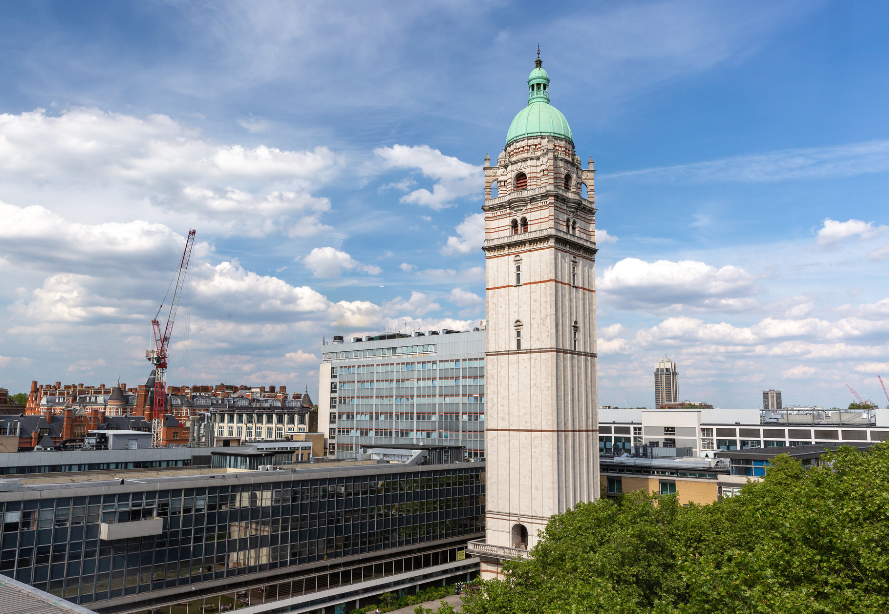
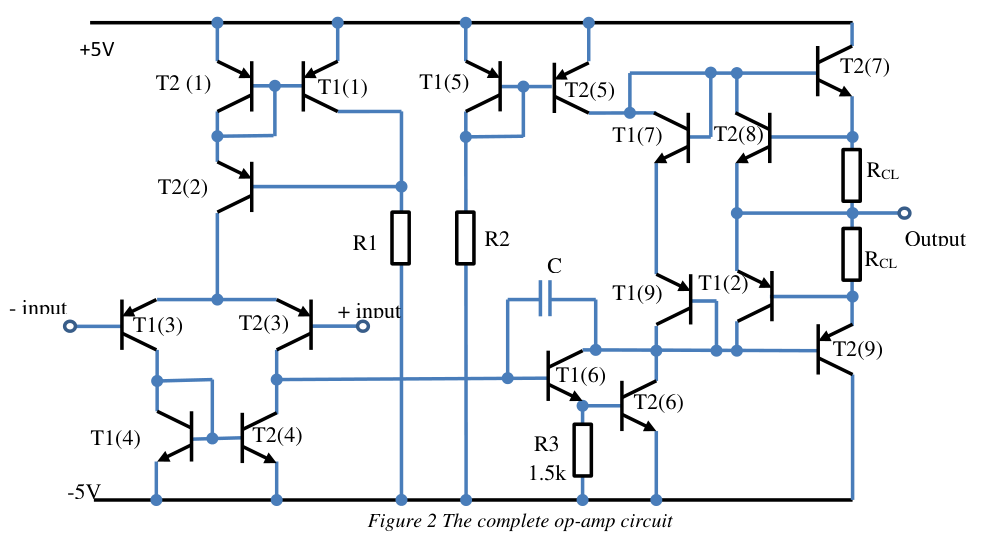
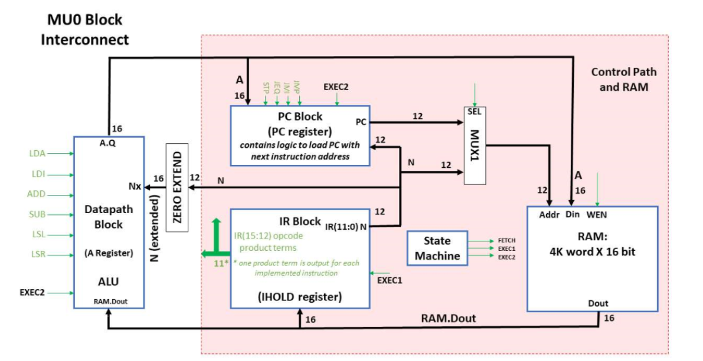
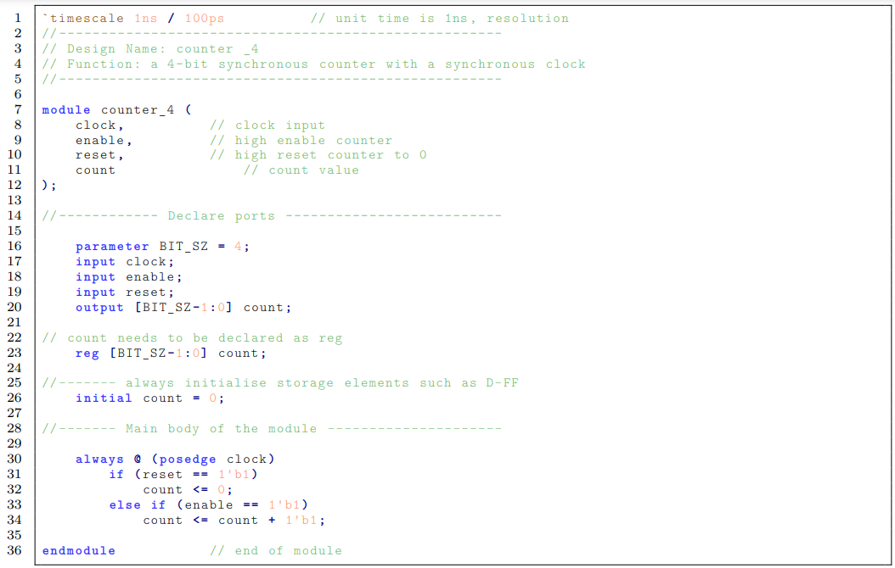
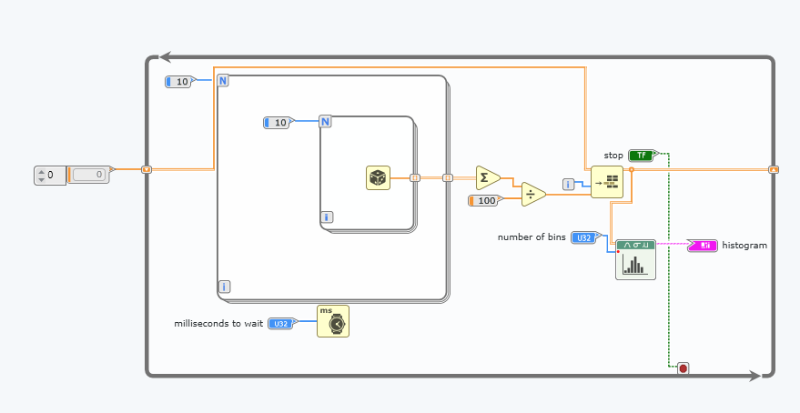

*Imperial College South Kensington Campus. That 12 story building in the middle is the EEE building. Source: www.imperial.ac.uk*

## Year 1
### Analysis and Design of Circuits 67.50%
This module is a 2 term module that covers the basics of electrical engineering. The first term focuses on a number of very fundamental concepts. These include  nodal analysis which is finding voltage potentials at different nodes of the circuit by creating algebraic equations, frequency responses which look analysing the phase and magnitude of signals at different frequencies and operational amplifiers which is a device that multiplies the difference between 2 inputs and can be used in many different applications such as feedback systems and filters. The lab involved creating circuits with opamps and measuring voltages using an oscilosope.

  
 *This setup is a summing amplifier that adds 2 signals and feeds the output to a speaker.*
 
 The second term focusses on transistors which are semiconductor devices that regulates current/voltages. There are 2 forms of transistors that we studied: MOSFETs and BJTs. Our lab involved first creating circuits using a BJT and then designing an opamp using the LTSpice simulator.

 
 *Complete design of the opamp*

### Digital and Computer Architecture 72.72%
Digital electronics covered the basics of digital logic, which is the study of computers at a binary level. It included truth tables, Boolean algebra and finite state machines. Our lab work involved using a circuit simulation software called ISSIE to simulate digital logic such as multiplexer, adders and counters. For the final project, we created a simple vending machine system using a finite state machine. The simulation software was pretty buggy and frustrating to work with. However eventually the professor fixed these issues. For computer architecture, we created a [simple arm-based virtual CPU](https://intranet.ee.ic.ac.uk/t.clarke/arch/deca/). 

 *ISSUE diagram of MU0 CPU architecture* 

I was really proud that we could run simple programs on this virtual CPU. Overall, I really enjoyed this course but the computer architecture part was difficult to understand at first because there were so many new terms .

### Mathematics 1A 61.00% and Mathematics 1B 69.18%
We learnt about complex numbers, calculus, differential equations, multivariable calculus, sequences and series, fourier series and transforms, vectors, linear algebra and other topics. Although this module was designed to cater to students of different educational backgrounds, I felt a little lost for some topics such as differential equations since it was not taught in IB HL math. Also, my time management in the first exam was poor which caused me to perform poorly. However, with a lot of practice, I managed to do decently in the final exam. Overall, I feel that learning math is really essential for nearly every other part of electrical engineering.

### Programming for Engineers 81.35%
This course covered the fundamentals of programming for beginners and was taught in C++. We learnt about some data structures like binary trees and vectors as well. Although I had some programming experience before, I really enjoyed this module and learning such a low level language.

### Topics in Electrical Engineering 74.10%
This module consists of 4 smaller modules covering PN diode, power electronics, waves and signals and communications. It was designed to give students a flavor of electrical engineering. Power electronics was my favorite submodule perhaps because the lecturer was really enthusiastic about his subject. The problems were also not too difficult after a bit of practice. PN diodes was fairly difficult since it covered a huge about of content in half a term. To be honest, I still do not understand a large portion of the content but the exam was restricted to some core concepts. Overall, I enjoy this topic since it delves into physics and hope to explore it in the future.

### Electronics Design Project 1 86.22%
We formed a group of 3 and chose the analog music synthesizer project to work on. I have written about this project in [another article](/project/analog-music-synthesizer-simulation). This project was very open ended apart from a few guidelines. We worked very hard on the project and report and ended up winning the best project in this category! I believe it was down to having good team effort and documentation. Having to work entirely online and with people in 3 different time zones was strange but we coped pretty well.

### German Level 1 Pass with Merit
At Imperial, we are given the opportunity to take an additional module in the humanities or languages. I chose to try learning German as it seemed like an interesting challenge. I enjoyed meeting people outside of my department and learning something beyond engineering and math. 

## Year 2
### Circuits and Systems 77.20%
Circuits and systems carries on from the ADC module in first year. We were introduced to the non idealities of opamps such as finite gain and settling time. We also had a chance to program with a DE10 Lite FPGA board and create circuits to interface the FPGA with analog circuitry such as DACs, ADCs and opamps. FPGAs are programmable chips which allows the programmer to create digital circuits using the Verilog Hardware Description Language.

*Verilog code for counter with reset*

### Communications 75.92%
The module starts of with analog communication such as amplitude modulation (AM), frequencies modulation (FM) and phase modulation (PM). We also learnt about the presence of noise in communication channels and calculating relative signal to noise ratios. The second half of the module moves on to digital communication techniques such as amplitude shift keying (ASK), frequency shift keying (FSK) and phase shift keying (PSK). Finally we were introduced to information theory and coding. The lab for this module used software defined radios to try out different communication schemes. To program this radio, we used NI Labview.

*Example of labview code taking the average of 100 random numbers*

### Control Systems 73.13%
I think the summary of the module from the notes explains it well: "To impose a given time-trajectory to one or more specific variables of an engineering system by acting on other variables that influence the behaviour of the system itself". The module first starts by exploring dynamic systems and describing them with mathematical equations. We then explore stability and the linear algebra required for  

### Electromagnetism 73.21%
### Mathematics for Engineers 53.41%
### Power Electronics and Power Systems 71.09%
### Signals and Systems 69.09%
### Engineering Design Project 2 79.45%
### German Level 2 Pass

## Year 3
### Analogue Integrated Circuits and Systems 62.50%
### Digital Signal Processing 64.33%
### Digital System Design 74.00%
### Instrumentation 79.00%
### Machine Learning 74.09%
### Optoelectronics 68.75%
### Real-time Digital Signal Processing 83.40%
### Origins: What we have learnt from science about the origin of the world, the Universe and Life Pass

## Year 4
### Computer Vision and Pattern Recognition 78.66%
### Digital Image Processing 85.00%
### Full-Custom Integrated Circuit Design 79.93%
### Hardware and Software Verification 81.16%
### Individual Project 78.07%
### Radio Frequency Subsystems 61.60%
### Sensors 87.00%
### Ethics and Sustainability Pass
