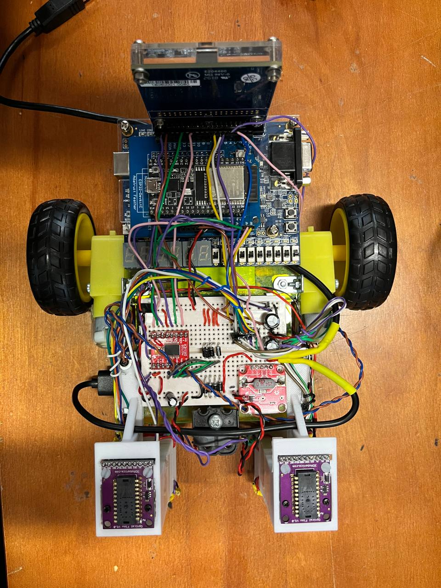

As part of my second-year group project, we were tasked to create an autonomous mars rover with the following specifications:

- Camera with FPGA processor to detect aliens (ping-pong balls) and obstacles (striped cylinders)
- ESP32 to be the brains of the system; Sending telemetry to a server, scheduling data collection and implementing a control algorithm
- Optical flow sensor to detect velocity and position and motor driver to control motor
- Dashboard to plot path of rover and position of features (aliens, obstacles and bunkers)
- Doppler radar to detect subterranean alien bunkers (spinning fans with metal reflectors)
- Solar panel and SMPS to charge a USB power bank

I primarily worked on the drive and radar subsystems. In the drive subsystem, I wrote C++ code to implement a PD control algorithm and interface the optical flow sensors and motor controller. The optical flow sensor seems to be quite poor on the simulated martian surface which was a huge challenge. To improve performance, we tried multiple sensors, enclosures, LEDs and a calibration sequence. In the radar subsystem, I created a bandpass filter, peak detector and frequency detector for processing the doppler radar intermediate frequency. However in the end the radar part was not assessed since the lab could not procure enough radars for all the teams that had fried theirs. However, building analog circuitry, verifying it using LTSpice and testing it with an oscilloscope was quite interesting. I also had a small hand in the web submodule, specifically in the code for displaying a frame capture on HTML canvas.

This project was challenging overall, especially tuning the control algorithm and dealing with unexpected factors like voltage spikes which caused glitches in digital electronics. In the final days of the project, we worked 16-hour days and worked frantically to create a MVP. However, we felt slightly short in the end for the demonstration as the control algorithm could not be integrated with the search algorithm. However, the group did well for the report and we were awarded the best group award.

The final product is shown below!

*Look at that cable management! (Thanks George)*
