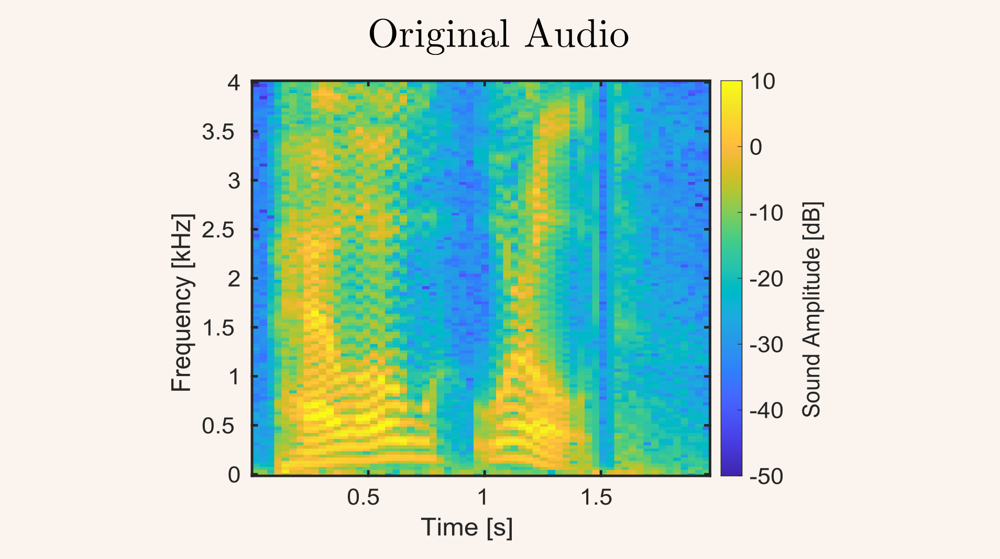
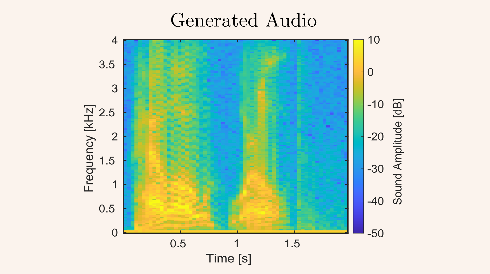

In my 3rd year, I took the real-time digital signal processing module. This module applies the theory of Digital Signal Processing in microcontrollers. In a group of 2, we created a voice synthesizer that could synthesize a message using Linear Predictive Coding (LPC). Since this course focussed only on the voice synthesis and not on text-to-speech, we were allowed to record an audio clip, encode this audio and then resynthesize this audio on the DSP board. The advantage of LPC is that the bit rate is greatly reduced which means that it would fit within the memory contraints of the DSP chip.  The hardware used was the TI D2837D LaunchPad and BOOSTXL_AUDIO boards and the software was created using Simulink embedded coder. 

The results with the best version of the synthesizer can be seen below:

<audio controls=" " style="margin-left:auto;margin-right:auto">
  <source src={props.data.projectPost.frontmatter.embeddedAssets[0].publicURL} type="audio/mpeg" />
  Your browser does not support the audio tag.
</audio>

<audio controls=" ">
  <source src={props.data.projectPost.frontmatter.embeddedAssets[1].publicURL} type="audio/mpeg" />
  Your browser does not support the audio tag.
</audio>
The generated audio also demonstrates a pitch shift.

