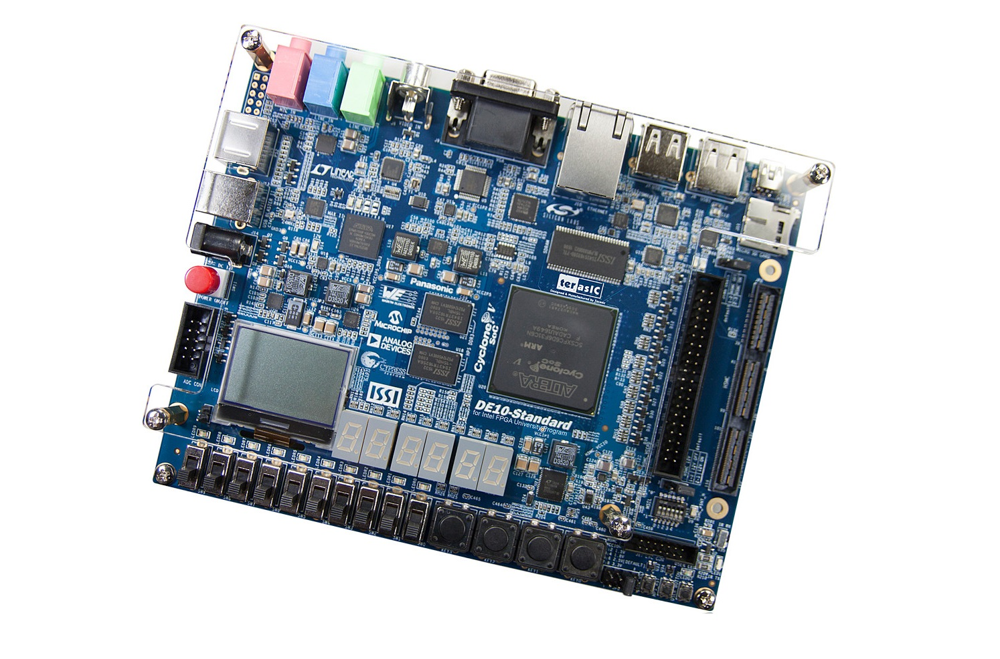
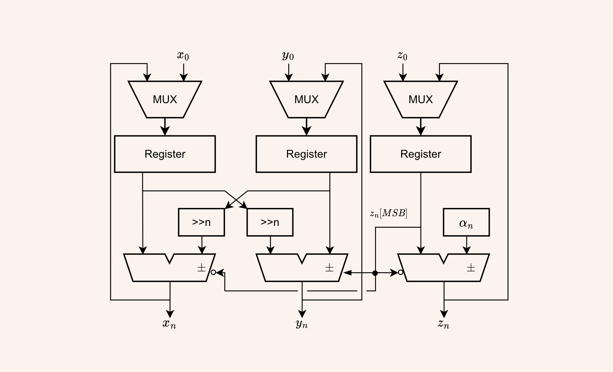

import { InlineMath, BlockMath } from 'react-katex';

In my 3rd year, I took the digital systems design module. This module introduced design digital systems implemented with Field Programmable Gate Array devices, memory devices and microprocessors. For the coursework, we were tasked with accelerating a function shown below.

<BlockMath math={'f(x) = \\sum^N_{i=1} 0.5 \\cdot x_i + {x_i}^2 \\cdot \\cos\\bigg(\\frac{x_i-128}{128}\\bigg)'} />

We implemented the digital system on an Altera Cyclone V FPGA development board using the NIOS II embedded processor. This processor was modified by adding a custom instruction to a hardware block that calculated a single iteration of the summation. To accelerate the computation, we used:

 - CORDIC algorithm which only uses shifts and adds for computating Cosine
 
 - Floating-point operators to replace floating-point emulation in fixed-point operators
 - Parallelism to reduce latency
 - Cache tuning

