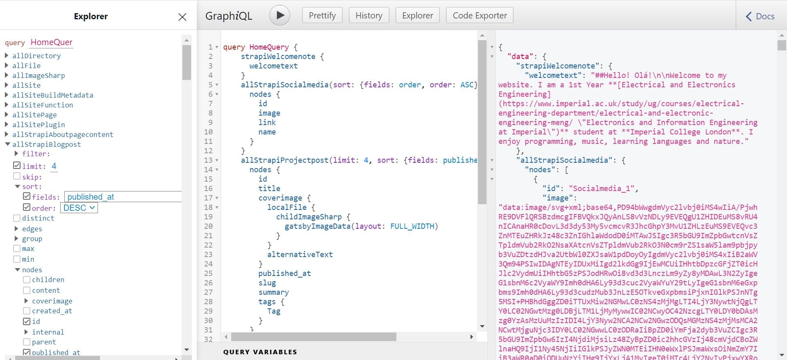

**TLDR:** This website was creating using Gatsby, hosted on Netlify, and Strapi.io, hosted on Heroku. The database is PostgresSql on Heroku and Media storage is hosted on Cloudinary.

## My motivations

Around January of this year, I attended a talk by [Sam Larsen-Disney](https://sld.codes/) about web development showcasing the latest technologies in front-end technologies. I was inspired to learn a Javascript framework and create a project using it. I chose to create a personal portfolio website as I wanted a location to showcase all the projects I have done. My prior experience in web development included creating several websites in Wordpress although I did not build anything completely from scratch. This website would be different. I would be in control of the full-stack and create a website to my liking.

I wanted a website to have the following:
- Portfolio of my best projects and photographs
- Contact form
- Distraction free reading experience
- Javascript framework
- Admin panel to create and update content

*A website to call my home (taken by me in Singapore on Ektar 100 film)*

## Creating the Front-end in React
After my exams in May, I started by creating the frontend using React on my laptop. There were many things I learnt along the way including CSS features like grid and flex and Javascript ES6 features. Learning React was a really interesting experience. I began my journey by looking at the default app created from create-react-app and then accessed some resources from [w3schools.com](https://www.w3schools.com/REACT/default.asp). The most confusing part of React was thinking about classes and functions as components in JSX although once I got it, I really enjoyed working with them. I created individual files for each component which allowed me to easily segment my code. I discovered about the react-router library and client side rendering which was quite exciting to learn about since the page simply re-renders when a user clicks an internal link.

I chose not to use a CSS framework as I wanted to practice with native CSS and since flex and grid seemed to solve most of my issues. I would like to try using a pre-processor or framework in the future.

## Back-end
I then worked on finding a content management system for my website. I read-up extensively on the [Wordpress REST API](https://developer.wordpress.org/rest-api/) which was very attractive since there are a myriad of features already built in. However, I felt that WordPress is not as customisable and fast as I would have liked it to be. I also explored [Strapi.io](https://strapi.io/) and Contentful. Finally, I chose to use Strapi.io which is a self-hosted and open source CMS unlike Contentful which is a SaaS. 

Configuring Strapi.io is simple with plenty of documentation to create content routes. The admin panel is also very clean and easily understood. At this point, I was using the REST API in the CMS and gradually moved to using GraphQL since I could request just the right content that I needed.

I chose to use the default markdown editor so that I do not need to store HTML in my database which has security risks and can be hard to work with in future updates to the front end. I am using the [showdown library](http://showdownjs.com/) for converting markdown to html in the frontend. This works great but I would like to create my own markdown library in the future and add more features such as embedded galleries.

## Hosting
I then needed to figure how to deploy my website. My prior experience was with cPanel shared hosting such as BlueHost, Hostgator and Hostinger. On further reading, I realized that significant configurations were required to deploy nodeJS apps on these services. I therefore decided to deploy my front-end on [Netlify](https://www.netlify.com) and my back-end on [Heroku](heroku.com) as per this [excellent article by Christopher Wray](https://strapi.io/blog/how-i-hosted-my-strapi-cms-driven-website-for-free). I also hosted the website media on Cloudinary since Heroku regularly purges uploaded media from the app repository.

These hosting options all featured free tiers which was useful in my case. Both Netlify and Heroku required a git repository to deploy from. Therefore, I learnt to used GitHub and implemented version controlling. I think version controlling is a fantastic feature to have in my toolkit since I can experiment with new features but roll back if it does not work.

## Redoing the Front-end in Gatsby
Heroku has this downside where the server [goes to sleep after 30 min of inactivity](https://hackernoon.com/how-to-prevent-your-free-heroku-dyno-from-sleeping-dggxo3bi2). This means that website visitors might experience load times of up to ~40s when accessing the site. This is completely unacceptable of course and needed a solutions. 

Gatsby to the rescue! [Gatsby](https://www.gatsbyjs.com/) is a lightning fast framework to generate static sites. In other words, all pages in the website are created at buildtime without any need to create them at run time. Gatsby has this feature called the [data layer](https://www.gatsbyjs.com/docs/tutorial/part-4/) constructed from data source eg. a CMS which can then be queried using a GraphQL API. This can be confusing at first but there is a GraphQL API playground called GraphiQL in development mode which allows me to make sure that my API requests are legitimate. 

After implementing Gatsby, I still realized that my page was loading really slowly. I used the Chrome Lighthouse tool to give me feedback and I learnt that image load time was the bottleneck. The solution to this issue was to use Gatsby's image plugin to create responsively sized images and store them in a static directory. This plugin also allows a lightweight SVG image to stand-in while the main image is loading. I really love how this looks!

An issue that I had and still have with the GraphQL API is that I receive an error if a particular field happens to be empty. For example, if I have no blog posts at the moment, the blog posts field will be empty. This was not the case when using the Strapi.io Rest API directly which would simply return a null. At the moment, I get around this issue by simply making sure there are not empty fields.

Gatsby also has a plugin to create a Progressive Web App which I installed. This is cool and fun but I still have not figured out whether I should keep or remove it.

On a completely different note, I learnt that a backend is completely unnecessary when working with Gatsby and that markdown files could be used to store content. However, I feel that I would need features such as tags which are not easily implemented in markdown. Furthermore without a backend, I would also need an external solution to deal with form data.

## Project Management
My mode of managing the development process was by initially creating notes on a OneNote file. I then moved to Github projects to organized my project according to the Kanban method. This simply means that tasks are classified as todo, in progress or completed. Arranging tasks in this fashion was a huge upgrade from the messy OneNote file. I still use that file, however, as it allows my to doodle using my Wacom tablet and to arrange ideas spatially.

## Code Editor
When I began the project, I was using Brackets which is an open source editor previously maintained by Adobe. This editor is really clutter free and minimalist. However, it had its limitations such as indexing large projects. I therefore moved to using VSCode and instantly loved it. It has amazing capabilities such as a git tab and extensions that allow me to prettify my code, add style checks and query todo labels in code. There also exists a terminal within VSCode that allows me to run terminal commands very easily.

## Miscellanous Things

**Dark mode:** Created using CSS variables based on [this tutorial](https://lukelowrey.com/css-variable-theme-switcher/). This mode can be activated by setting the dark mode in the device or by toggling the theme button.

**Share button:** Implemented using the webshare API in supported browsers based on [this](https://www.telerik.com/blogs/using-web-share-api-react). Using the webshare API negates the need to create individual share options for every social media. 

**Search engine optimisation:** Created a reusable seo component in strapi.io based on the tutorial available in the [strapi.io blog](https://strapi.io/blog/headless-cms-strapi-seo-best-practices). 

## Conclusion
The following technologies were used in this project: ReactJS, GatsbyJS, Strapi.io, NodeJS, Netlify, Heroku, Cloudinary, Lighthouse, VSCode, Git and Github. I hope to redesign the website in the future in order to showcase my work even better.

Some of my inspirations for this website include [Sam Larsen-Disney](https://sld.codes/), [Yannis Panagis](https://yannispanagis.com/), [Queen Raae](https://queen.raae.codes/), and [Chris Wray](https://chriswray.dev/). Feel free to have a look at the [source code](https://github.com/TimothyJNewman/personal-website-gatsby).