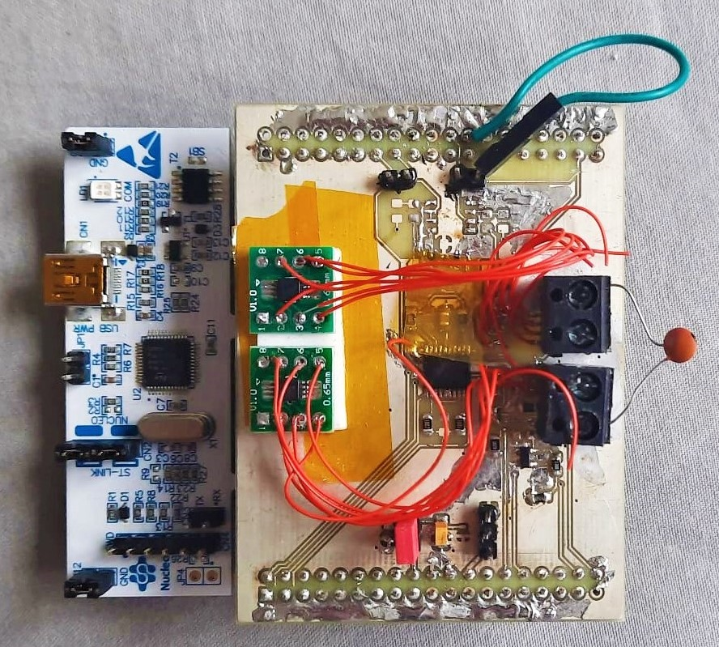
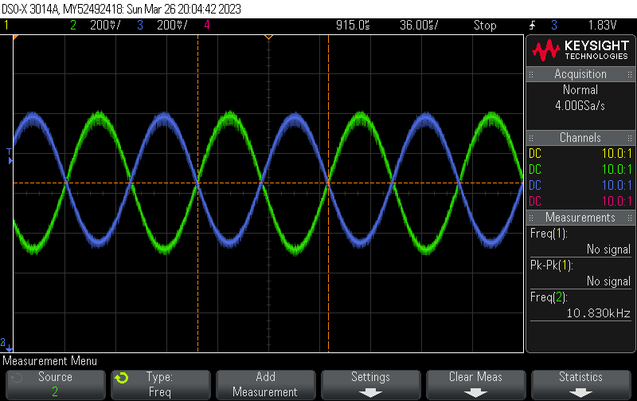

In my 3rd year, I took the instrumentation module. This module introduces electrical measurements in both theory and practice. For the coursework which was done in a group of 2, we created a complex impedance meter designed to measure devices (DUT) with impedance of 10 to 1MOhm using stimulus frequency of 1 to 100kHz. 

*Image of the completed device*

The analog frontend was implemented on a custom 2 layer PCB shield. It used a Auto-Balancing Bridge (ABB) as the backbone of the design. There was a multiplexer to select various reference resistors to closely match the impedance of the DUT and there were 2 instrumentation operational amplifiers to measure the voltages across the DUT and known reference resistor. 

The signal generator, Analog to Digital Converter (ADC) and Digital to Analog Converter (DAC) was implemented using an STM32 on a Nucleo 64 Development Board. DMA was configured send values from a look up table to the DAC and for the ADCs to read data in sync. The voltages was passed into the Goertzel algorithm to measure the magnitude and phase (this implementation of the Digital Fourier Transformation (DFT) is quick when measuring a single frequency). These voltages and the known resistance is then used to find the impedance.

*Measured signal from Instrumentation Amplifiers for 10.8kHz frequency with 510kOhm resistor*

During the demonstration, my group was not able to make the multiplexer work because we possibly ran too much current through it due to a short. There was also extensive rework to the board because the OP-AMP we used was could not operate at the 5V that we powered it with (although it was rated for 5-18V). Instead we used another opamp designed for low power applications. I have to mention our lab technician Amine who was very kind and helpful especially when he replaced the OP-AMPs.

Overall, the entire experience of designing, simulating, designing, assembling and testing an electronic circuit was enlightening and I really enjoyed it. I would like to work on a high-frequency analog circuit in the future.
