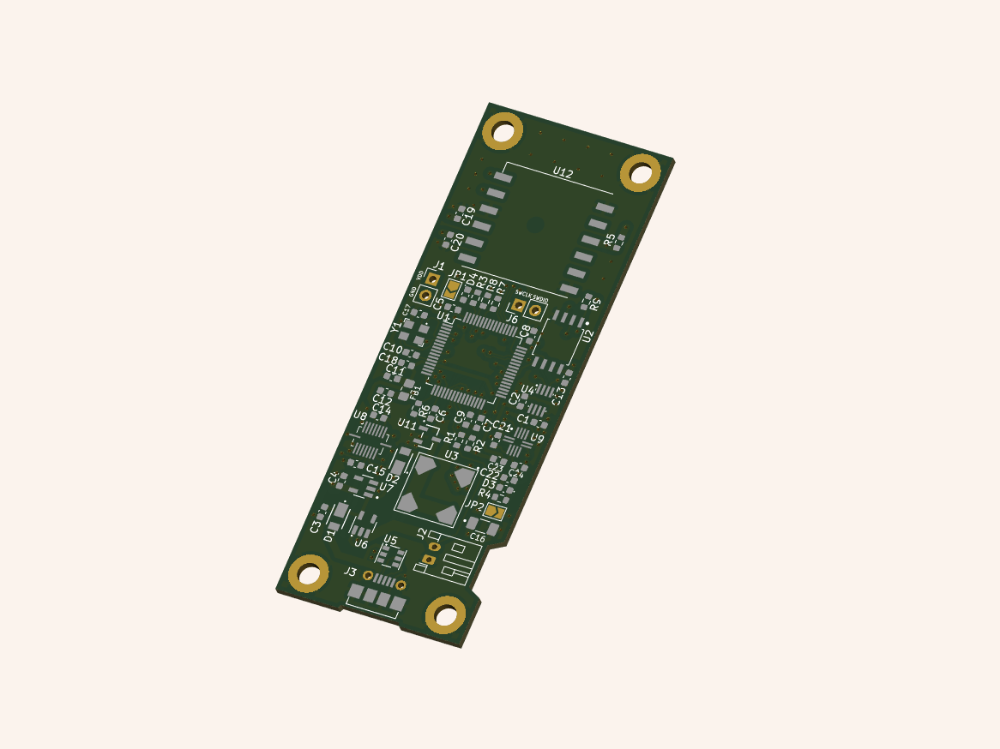

For the high powered rocketry (HPR) project, we designed a small gun powder powered rocket. We plan on launching the rocket on the 2nd of July at the East Anglian Rocketry Society rocket range at Cambridge. 

I was involved in designing the flight computer for the rocket. The flight computer has the following features:

 - Battery life of at least 20min
 - GPS for location data
 - Inertial Measurement Unit
 - Environment Sensor to measure temperature, humidity and pressure
 - Flash chip to store data
 - Radio for communicating GPS coordinates for recovery
 - Buzzer for aiding in recovery
 - Board width less than the inner 36mm inner diamter of the rocket tube and weight less than 100g

The current project, including hardware and software, can be found in [this repository](https://github.com/ImperialSpaceSociety/Flight-Computer). The schematic of the PCB can be viewed below.
<embed src={props.data.projectPost.frontmatter.embeddedAssets[0].publicURL} type="application/pdf" width="100%" height="600px" />

 
The 3D view of the PCB can be viewed below.

